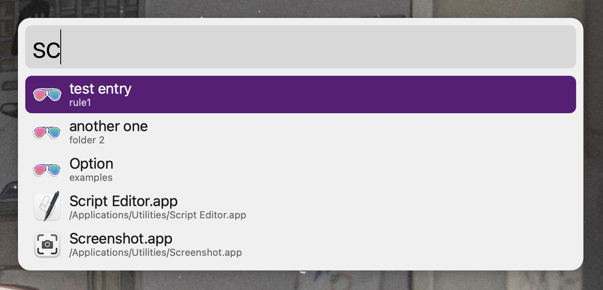
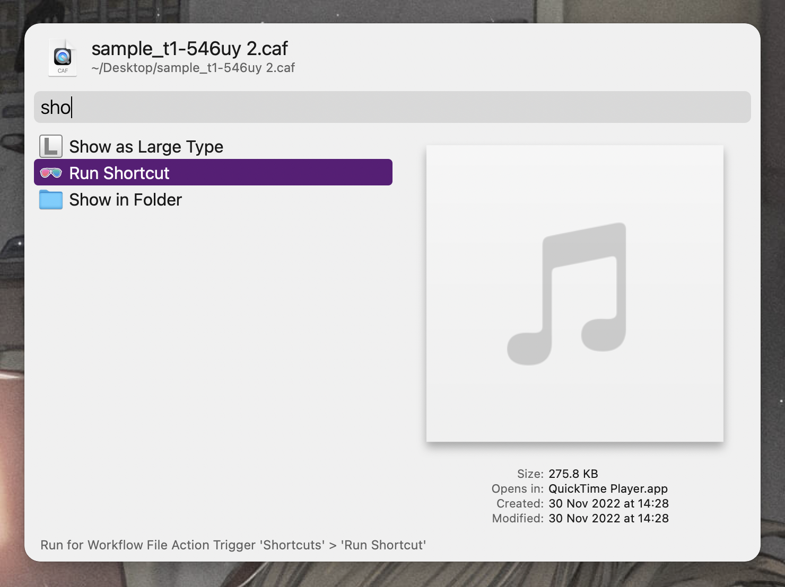
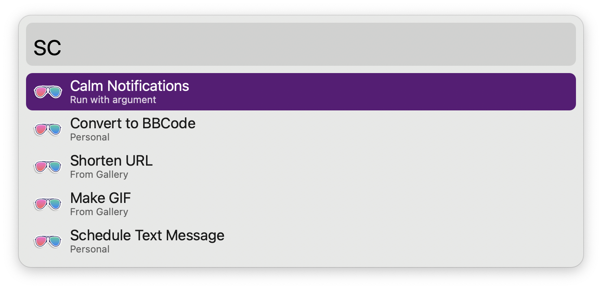
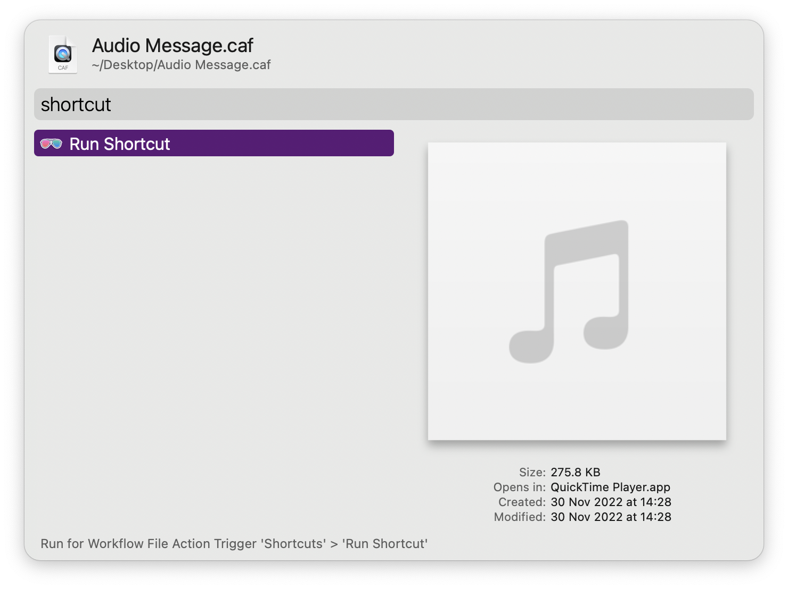

# Taking Good Screenshots

Workflow instructions in the Alfred Gallery must include images to complement the text. A great screenshot captures what is essential but not what is extraneous: it presents the Alfred window (but not a wallpaper) and what is available in your workflow (but not other features).

macOS can take screenshots of individual windows, preserving their shadow against a transparent background. Press <kbd>⌘</kbd><kbd>⇧</kbd><kbd>4</kbd> and your cursor will turn into a crosshair . Now press <kbd>space</kbd> and it will change into a camera icon . Move it over a window and it will get a blue overlay. Click to take the screenshot.

https://github.com/alfredapp/gallery-edits/assets/1699443/2378b5f0-a333-403f-87fc-df6a90d13b52

## Unsuitable Examples

The above screenshots have several issues:

* The wallpaper is visible, making the screenshot look out of place when embedded on a web page.
* Entries from other workflows and macOS are distracting and make it hard to discern what the workflow does.
* Data is disorganised and looks fake, making it difficult to understand its purpose.

## Good Examples

In the above:

* Screenshots are clean, capturing only the window and its shadow.
* Actions displayed are exclusive to this particular workflow.
* The data looks real, a true example of what using the workflow might be like.
