# Gallery Workflow Page Style Guide

The Alfred Gallery strives for consistency between workflow READMEs so users have an easier time navigating and picking up new workflows. While exceptions are inevitable, this document covers how to remain consistent in common situations.

Gallery pages are separate from a workflow’s internal [About](https://www.alfredapp.com/help/workflows/advanced/sharing-workflows/#about), but they can contain overlapping or equal information.

* [Introduction](#introduction)
* [Universal Actions](#universal-actions)
* [Screenshots](#screenshots)
* [Modifiers](#modifiers)
* [Alternative Invocations](#alternative-invocations)
* [Related Keywords](#related-keywords)
* [Many Keywords](#many-keywords)
* [Hokeys](#hokeys)
* [Workflow Configuration](#workflow-configuration)
* [Setup](#setup)

## Introduction

Start with `## Usage` and one or two short sentences describing the main action on the workflow. `Search` is a great way to begin if the action involves any type of filtering through results.

End with <code>via the `INPUT` keyword</code>. Use `keyword` even if referring to a Script Filter, File Filter, or similar. Occasional use of `with` instead of `via` helps to mix it up.

[alfredapp/shortcuts](https://alfred.app/workflows/alfredapp/shortcuts/)

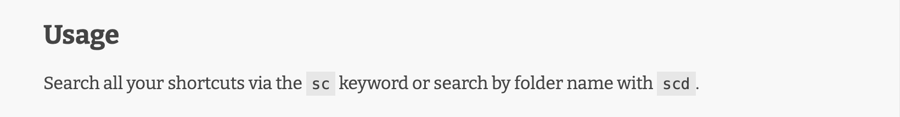

[alfredapp/applescript-dictionaries](https://alfred.app/workflows/alfredapp/applescript-dictionaries/)

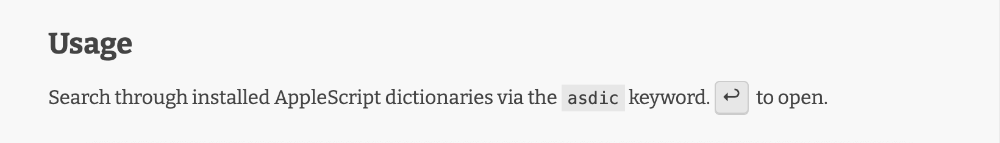

[alfredapp/network-quality](https://alfred.app/workflows/alfredapp/network-quality/)

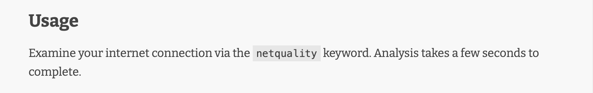

## Universal Actions

When describing a Universal Action, end with `via the [Universal Action](https://www.alfredapp.com/help/features/universal-actions/)`, linking to the documentation. Use `Universal Action` even if referring to a File Action.

[alfredapp/tinypng](https://alfred.app/workflows/alfredapp/tinypng/)

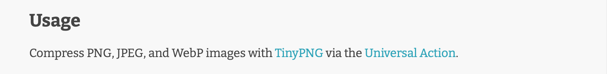

[alfredapp/applescript-dictionaries](https://alfred.app/workflows/alfredapp/applescript-dictionaries/)

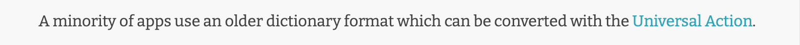

## Screenshots

Continue with an image directly illustrating the text. See [Taking Good Screenshots](https://github.com/alfredapp/gallery-edits/blob/main/Documentation/Taking%20Good%20Screenshots.md).

[alfredapp/shortcuts](https://alfred.app/workflows/alfredapp/shortcuts/)

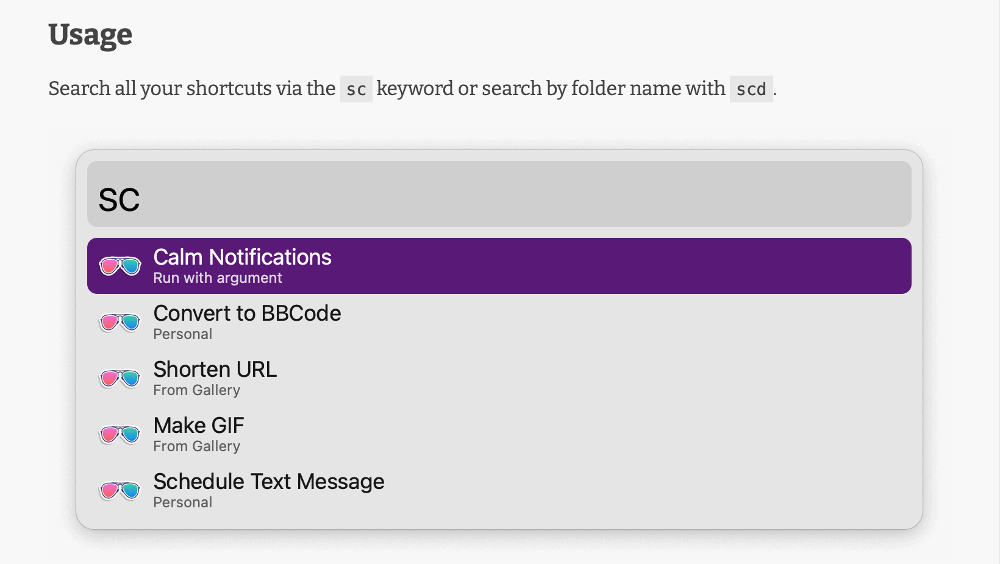

[alfredapp/tinypng](https://alfred.app/workflows/alfredapp/tinypng/)

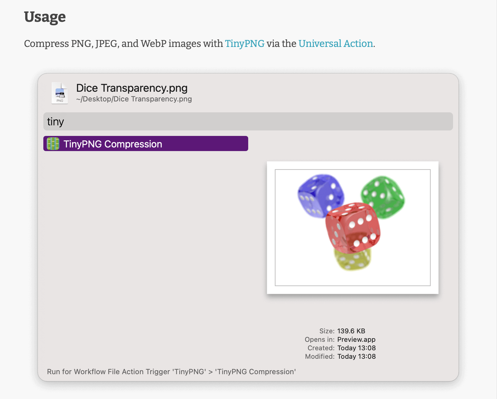

## Modifiers

List modifiers below the image in the format `* KEY: ACTION`. Use ↩&#xFE0E;⌘⌥⌃⇧ for the keys, surrounding each character in the `<kbd>` HTML tag.

For previewing with Quick Look, use `* <kbd>⌘</kbd><kbd>Y</kbd> (or tap <kbd>⇧</kbd>): Quick Look SOMETHING`.

[alfredapp/shortcuts](https://alfred.app/workflows/alfredapp/shortcuts/)

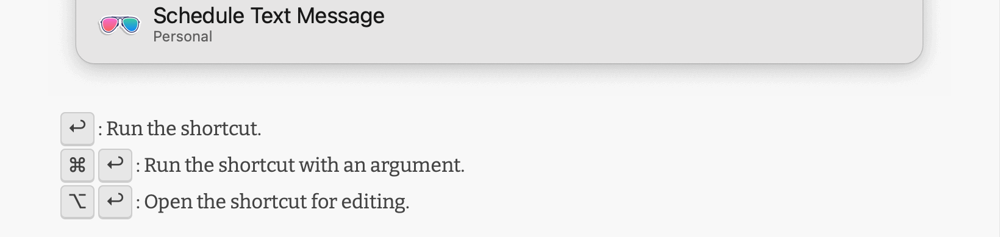

[vitor/mtg-card-search](https://alfred.app/workflows/vitor/mtg-card-search/)

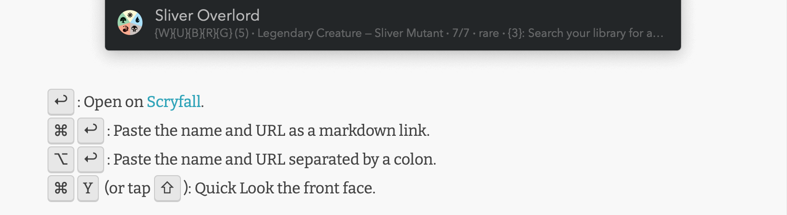

## Alternative Invocations

Is there both a keyword and Universal Action for the same task? Use `Alternatively,` and another screenshot.

[alfredapp/tinypng](https://alfred.app/workflows/alfredapp/tinypng/)

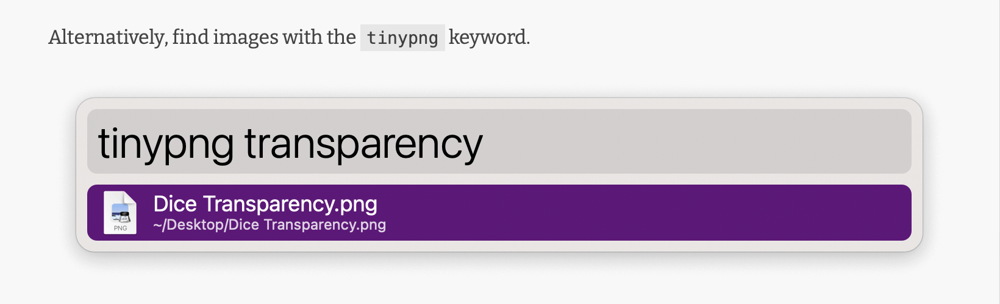

## Related Keywords

Group related keywords on the same sentence.

[alfredapp/shortcuts](https://alfred.app/workflows/alfredapp/shortcuts/)

[alfredapp/ignore-in-alfred](https://alfred.app/workflows/alfredapp/ignore-in-alfred/)

## Many Keywords

Make a list of items of the form <code>* `INPUT`: ACTION</code> when there are a large number of keywords.

[vitor/paper-formats](https://alfred.app/workflows/vitor/paper-formats/)

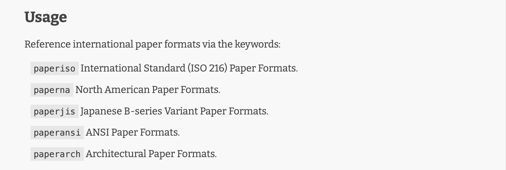

[gingerbeardman/fsnotes](https://alfred.app/workflows/gingerbeardman/fsnotes/)

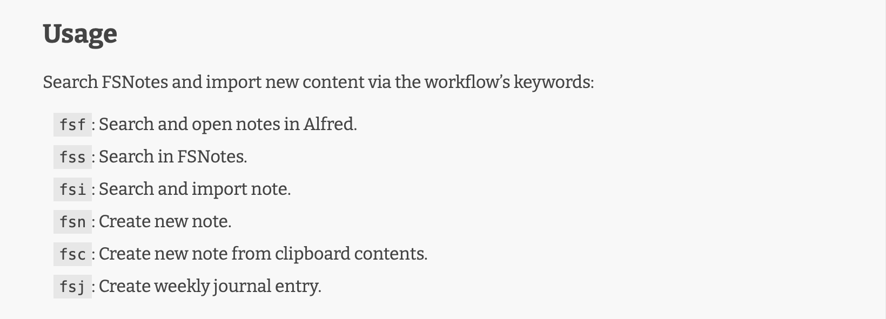

## Hotkeys

Mention Hotkeys with `Configure the [Hotkey](https://www.alfredapp.com/help/workflows/triggers/hotkey/) SOMETHING`, linking to the documentation.

[alfredapp/paste-as-plain-text-from-hotkey](https://alfred.app/workflows/alfredapp/paste-as-plain-text-from-hotkey/)

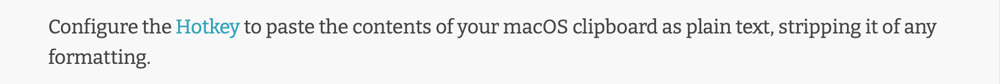

[alfredapp/window-switcher](https://alfred.app/workflows/alfredapp/window-switcher/)

## Workflow Configuration

Configuration should be explained in the workflow itself, but it is OK to mention the occasional relevant option users might otherwise miss.

[alfredapp/placeholder-images](https://alfred.app/workflows/alfredapp/placeholder-images/)

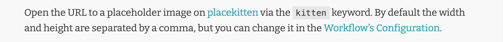

[alfredapp/amazon-suggest](https://alfred.app/workflows/alfredapp/amazon-suggest/)

## Setup

Add `## Setup` above the Usage section if extra manual steps are required before using the workflow. Leave out required Configuration items because Alfred itself warns of those. Leave out installing apps, Homebrew formulae, or setting API keys because the Gallery mentions those in a separate section.

[alfredapp/1password](https://alfred.app/workflows/alfredapp/1password/)

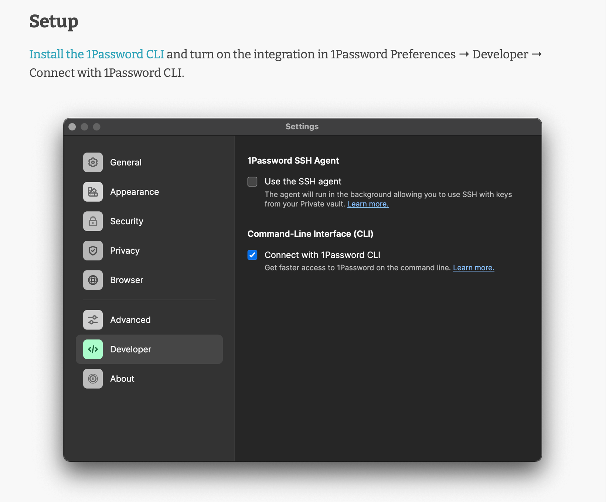

[alfredapp/pause-tabs](https://alfred.app/workflows/alfredapp/pause-tabs/)

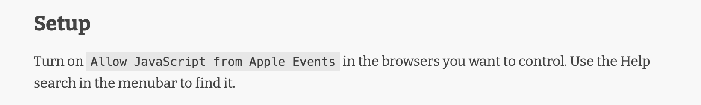
