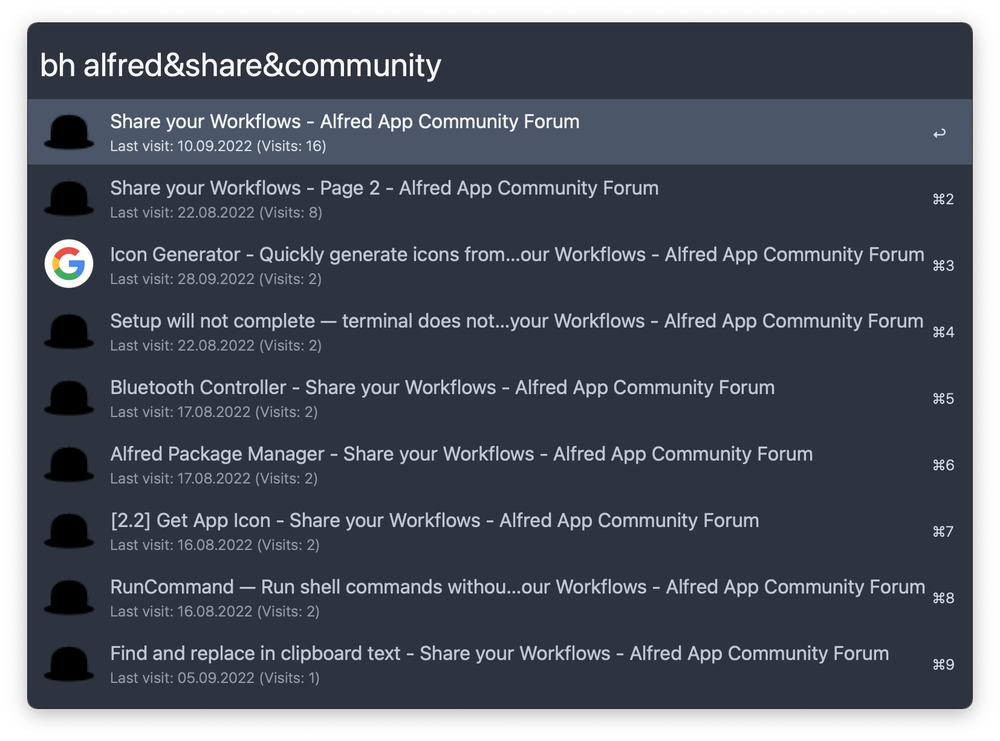

## Usage

Search browser history via the `bh` keyword and search bookmarks with `bm`.

Type `&` between search terms to search for multiple entries. Example: `Car&Bike` matches entries with `Car or Bike rental` but *not* `Car driving school`.

Supported browsers include [Google Chrome](https://www.google.com/chrome/), [Chromium](https://www.chromium.org/chromium-projects/), [Brave](https://brave.com), [Opera](https://www.opera.com), [Sidekick](https://www.meetsidekick.com), [Vivaldi](https://vivaldi.com), [Edge](https://www.microsoft.com/en-us/edge?form=MA13FJ), [Arc](https://arc.net), [Dia](https://www.diabrowser.com/), [Thorium](https://thorium.rocks/), [Comet](https://www.perplexity.ai/comet), and [Safari](https://www.apple.com/safari/).
