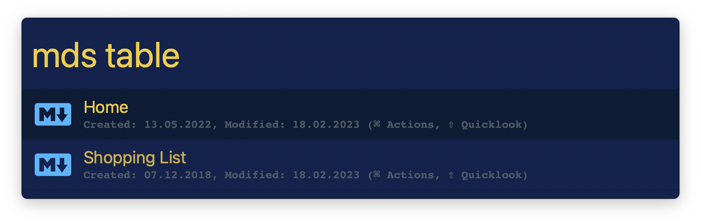
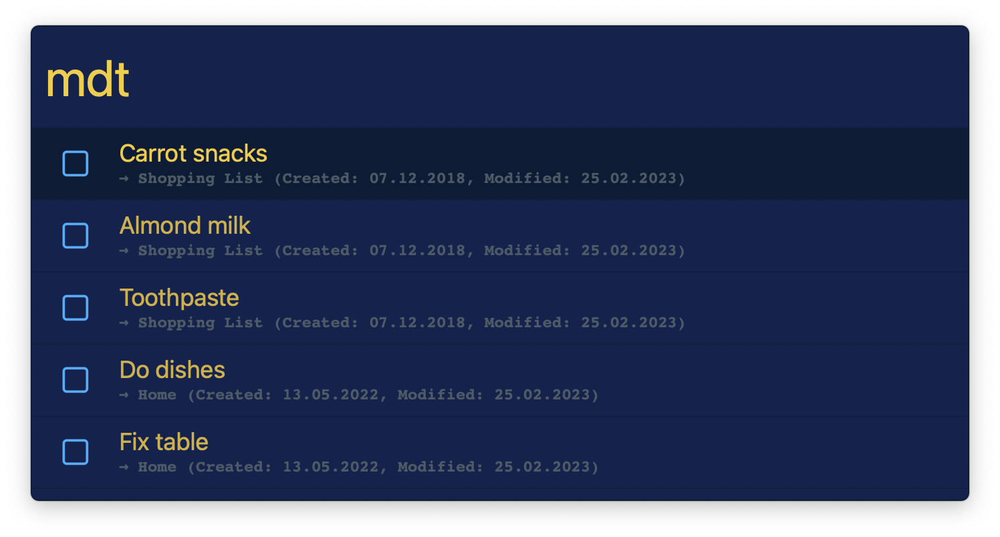
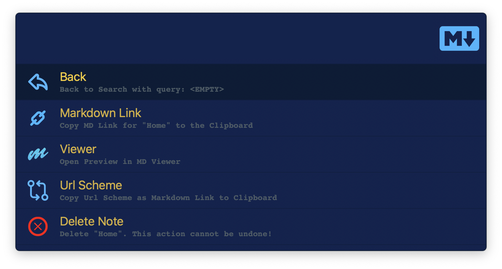
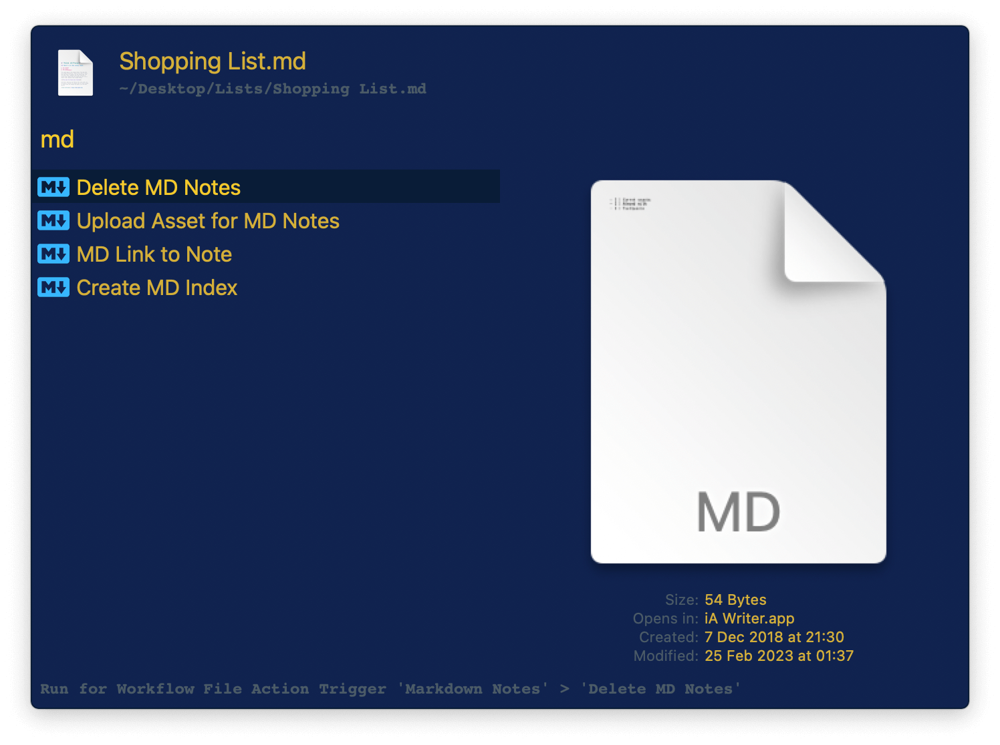
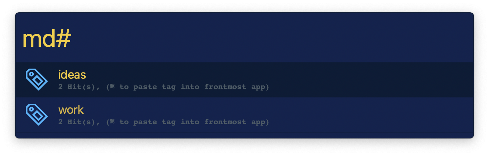
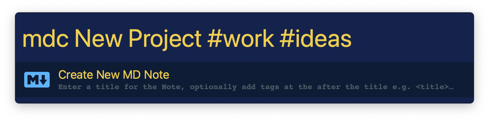

## Setup

Set the location of your markdown files folder and your markdown editor and viewer apps in the Workflow’s Configuration.

## Usage

Search the contents of markdown files via the `mds` keyword. `&`, `|`, and `*` help refine your search:

* `wood table` Search for exact phrase.
* `wood&table` Search for both words.
* `wood|table` Search for either word.
* `tab*` Search for words starting with `tab`.



Search for task list items with the `mdt` keyword.



In both cases, <kbd>↩</kbd> opens the file in your markdown editor and <kbd>⌘</kbd><kbd>↩</kbd> reveals more actions.



Further options are available with the Universal Actions.



Search tags with the `md#` keyword. Tags can be added to files with simple syntax:

```
Tags: #work #ideas
```



If a tag matches the configured Bookmark Tag keyword, the URLs from that file will be displayed with the `mdb` keyword.


Create new notes via `mdc`. Give a title optionally followed by tags.


