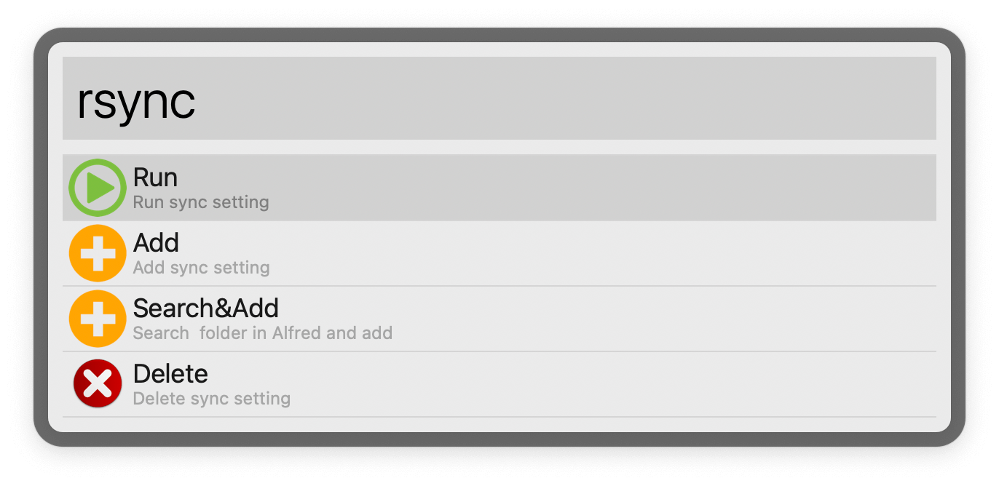
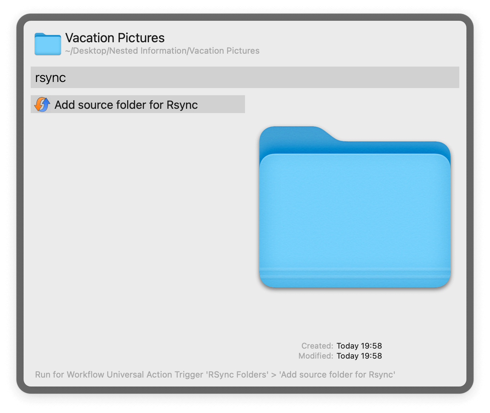

## Usage

Add your source and target folders via the options in the `rsync` keyword. To sync the folder contents of the source to the target, invoke `rsync` again followed by `Run`.

Use the Universal Action on the source folder as an alternative to setting up.

