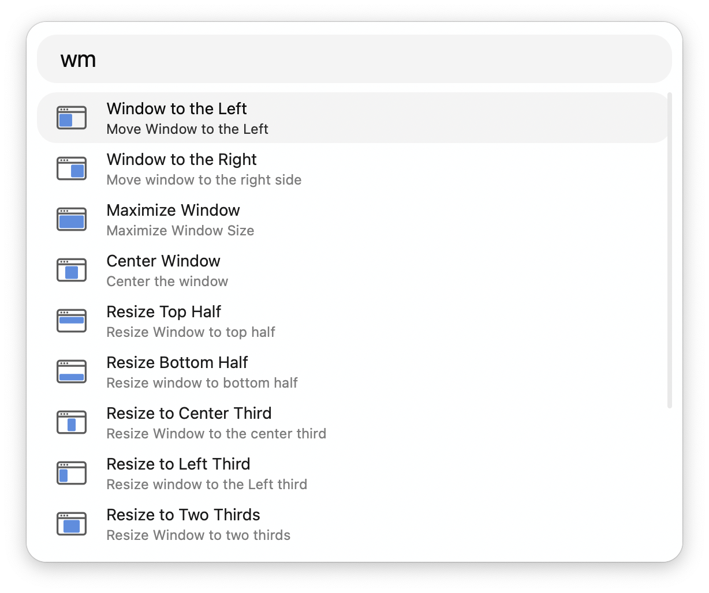

## Usage

Configure the Hotkeys to resize and rearrange your windows. Actions which resize the window absolutely, such as maximising and centring two thirds, have their initial state stored to allow the window position and size to be reset.

Alternatively, list size options via the `wm` keyword.

