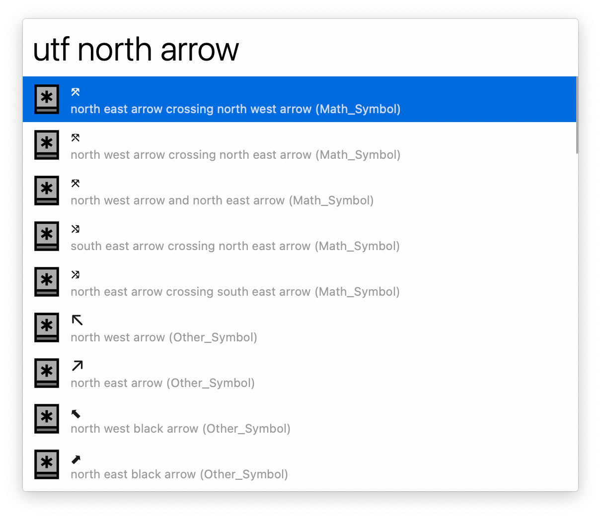
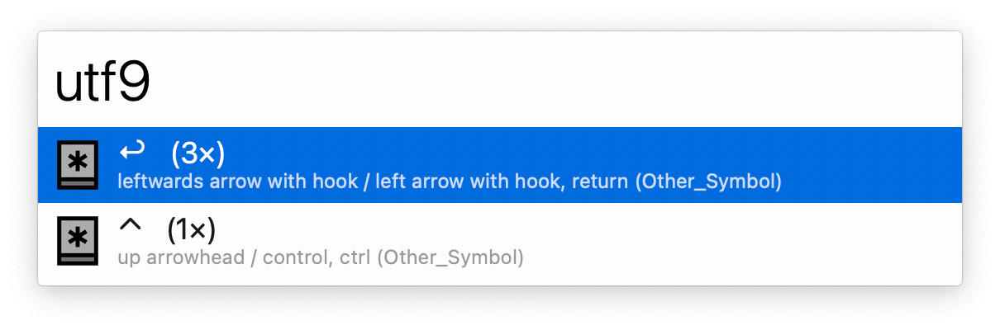
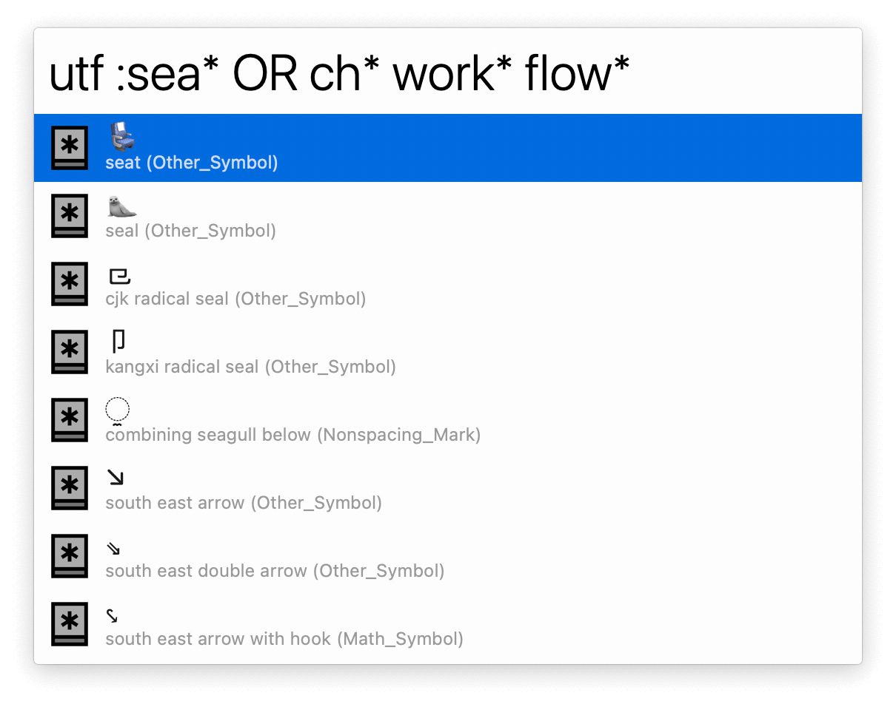
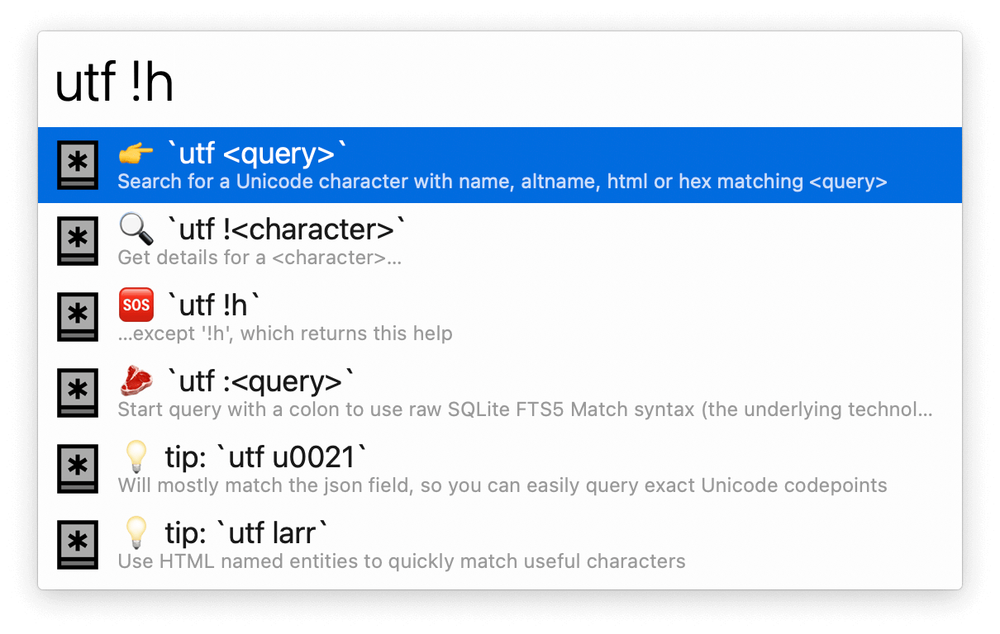

## Usage

Search through Unicode symbols via the `utf` keyword.

* <kbd>↩</kbd> Paste symbol.
* <kbd>⌘</kbd><kbd>↩</kbd> Paste as HTML entity.
* <kbd>⌥</kbd><kbd>↩</kbd> Paste as Unicode escape sequence.
* <kbd>⌃</kbd><kbd>↩</kbd> Paste as hexadecimal representation.

Reuse a symbol via the `utf9` keyword, which shows your most used.

Start your query with `!` to get information on a symbol.

Or with `:` to perform advanced searches with SQLite syntax.

Use `!h` for help on the available commands.

