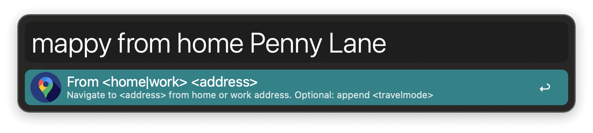

## Usage

Start a route in Google Maps via the `mappy` keyword followed by a destination.

By default the starting point is your current location. Begin a query with `to` or `from` `home` or `work` to use the places in the Workflow’s Configuration.

Adding a mode of transportation at the end temporarily overrides your settings.

