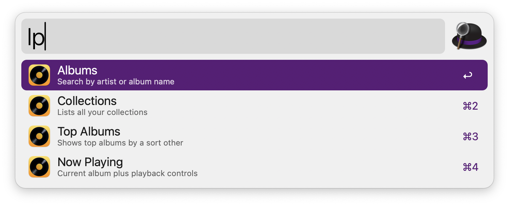

## Usage

Search and control your Longplay music library via the `lp` keyword and its variants.

All command start with `lp`:

- `lp $term`: Search for albums and playlists. Then play or enqueue.
- `lpc`: List **c**ollection, then get albums/playlists, or start album shuffle.
- `lpt`: List sort order, then get **t**op albums/playlists for that order, or start album shuffle.
- `lps`: Get now playing **s**tatus, then pause/skip/stop or rate current track.

