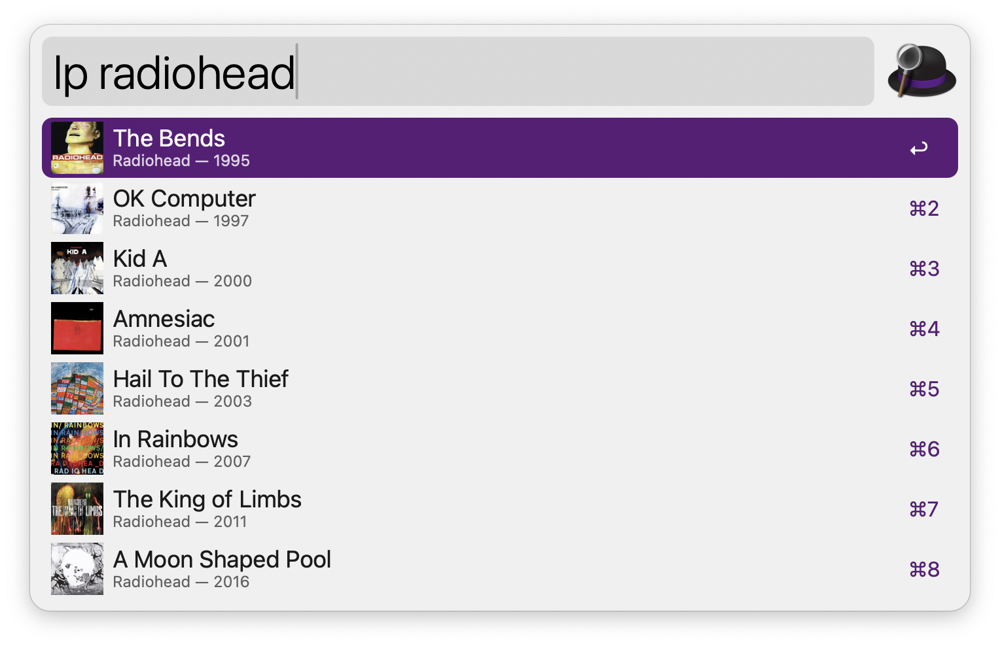
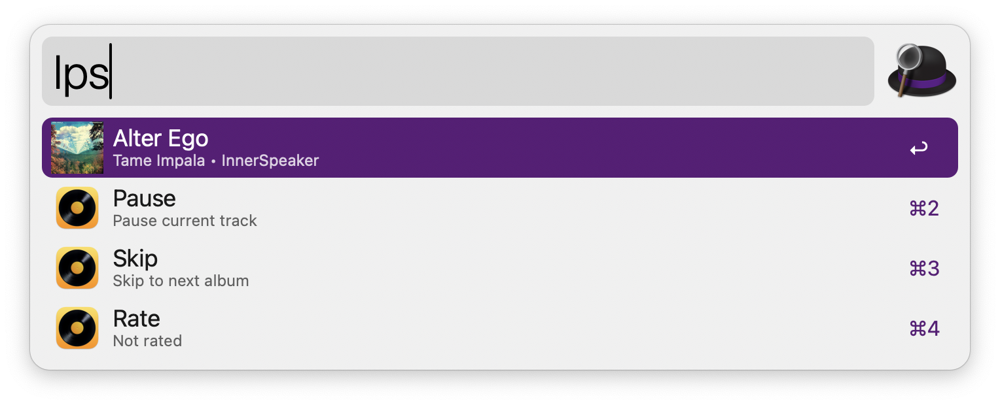

## Usage

Search for albums and playlists via the the `lp` keyword.

* <kbd>↩</kbd> Play or enqueue.
* <kbd>⌘</kbd><kbd>↩</kbd> Play now.

List collections via the `lpc` keyword.

--- MISSING SCREENSHOT ---

* <kbd>↩</kbd> List albums in collection.
* <kbd>⌘</kbd><kbd>↩</kbd> Start album shuffle.

List sort order with `lpt`.

--- MISSING SCREENSHOT ---

* <kbd>↩</kbd> List top albums/playlists for chosen order.
* <kbd>⌘</kbd><kbd>↩</kbd> Start album shuffle.

Get now playing status with `lps` and pause/skip/stop or rate current track.

