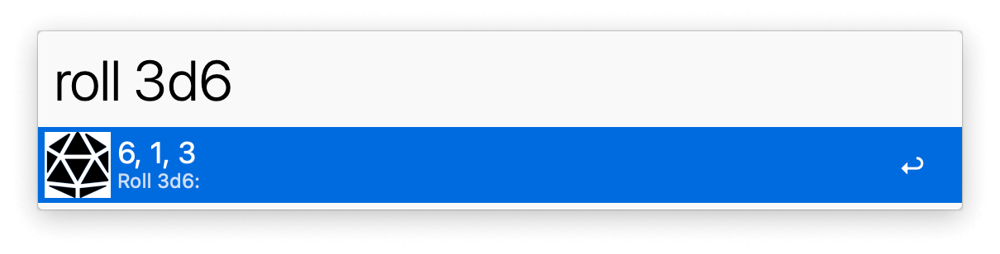
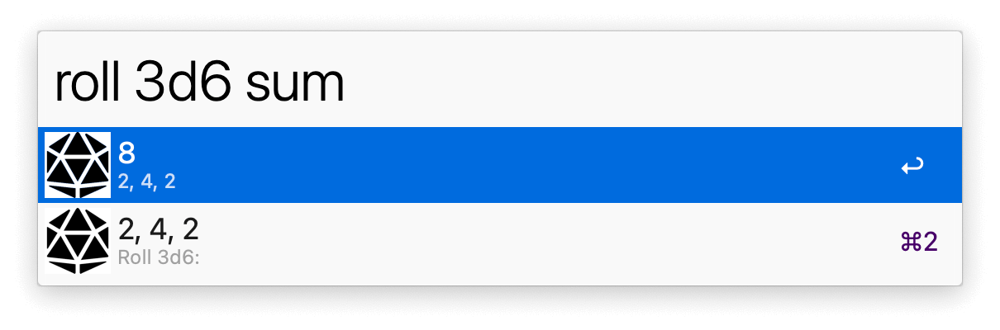
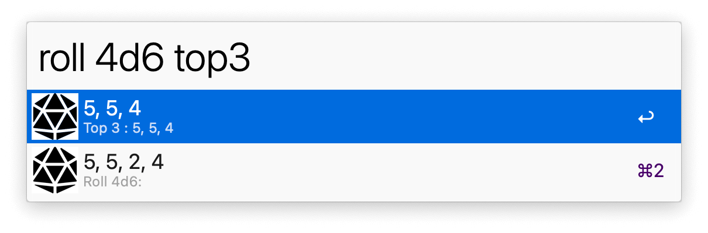
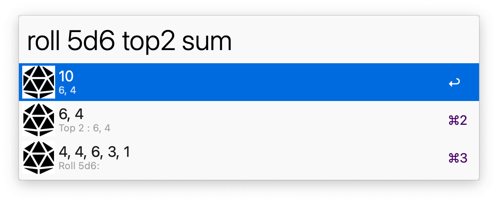

## Usage

See the result of different dice rolls via the `roll` keyword. <kbd>↩</kbd> to copy the output to the clipboard. Control the checks with the special syntax:

* `X` Roll one X sided die.
* `XdY` Roll X number of Y-sided dice.
* `sum` Sum dice after rolling.
* `topX` Get X largest dice.
* `bottomX` Get X smallest dice.
* `>X` Get number of dice > X.
* `+X/+Y` Add +X and +Y to the first two dice rolled.

