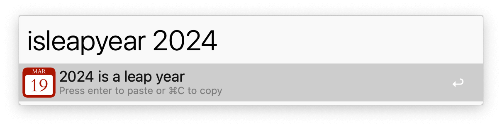
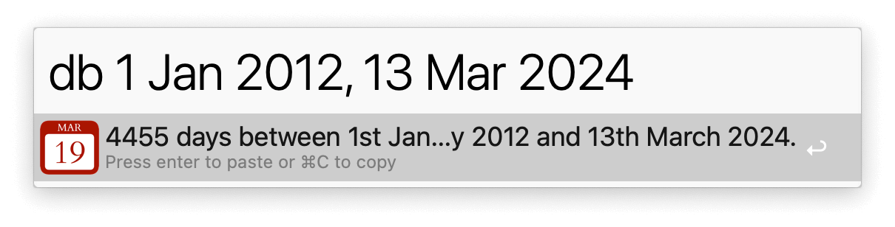

## Usage

Show the day number of a given date via the `dn` keyword.

Check for leap years with the `isleapyear` keyword.

See the number of days between two dates via the `db` keyword. Separate the start and end dates with a comma.

