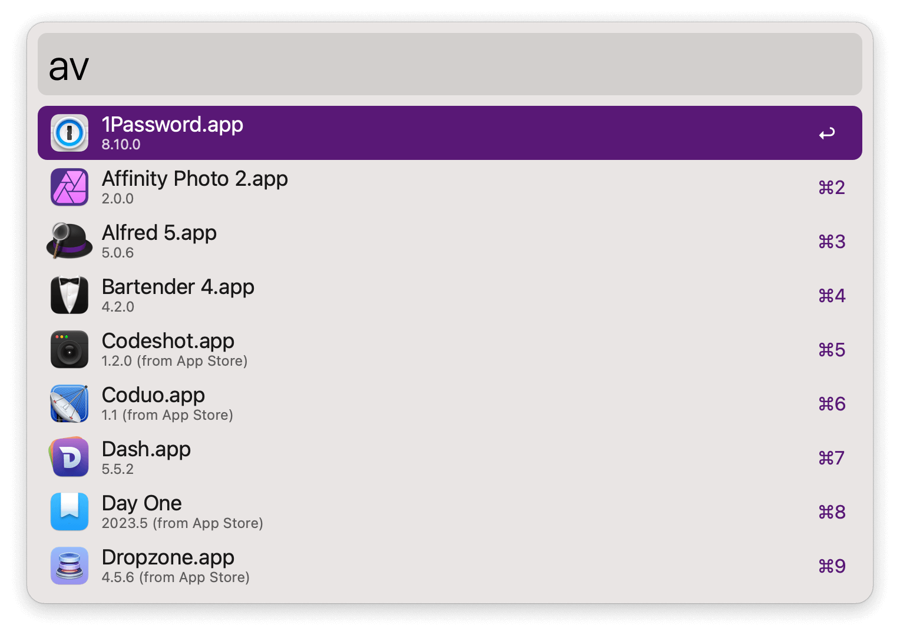
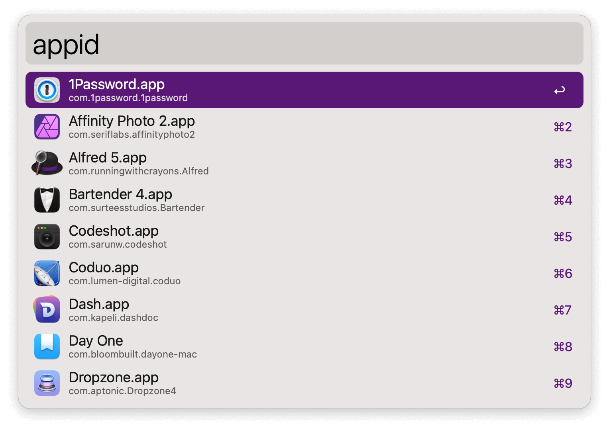
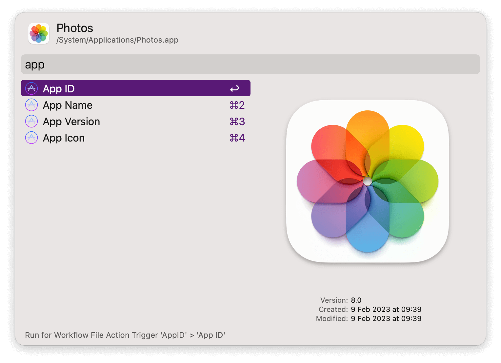

## Usage

List the versions of installed apps via the `av` keyword.

Or list app bundle identifiers with the `av` keyword.

In both cases <kbd>↩</kbd> copies the information to the clipboard.

The Universal Actions add an alternative to copy the same information, plus the name and app icon. In the latter, <kbd>↩</kbd> copies to the clipboard while <kbd>⌘</kbd><kbd>↩</kbd> shows its location in the Finder.

