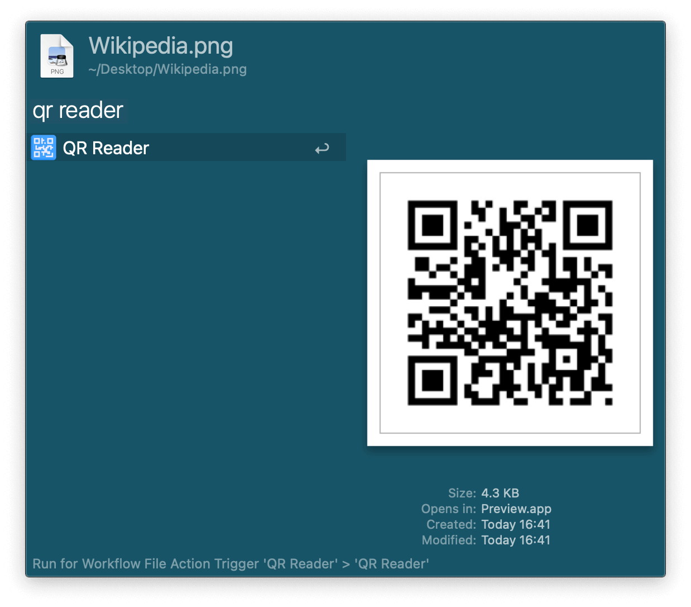
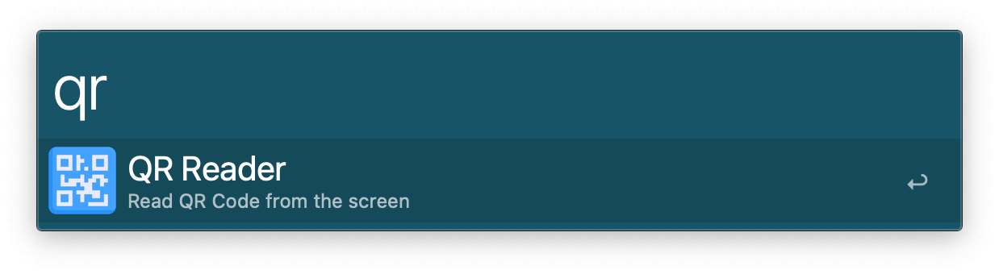
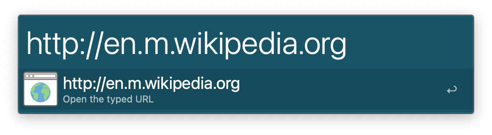
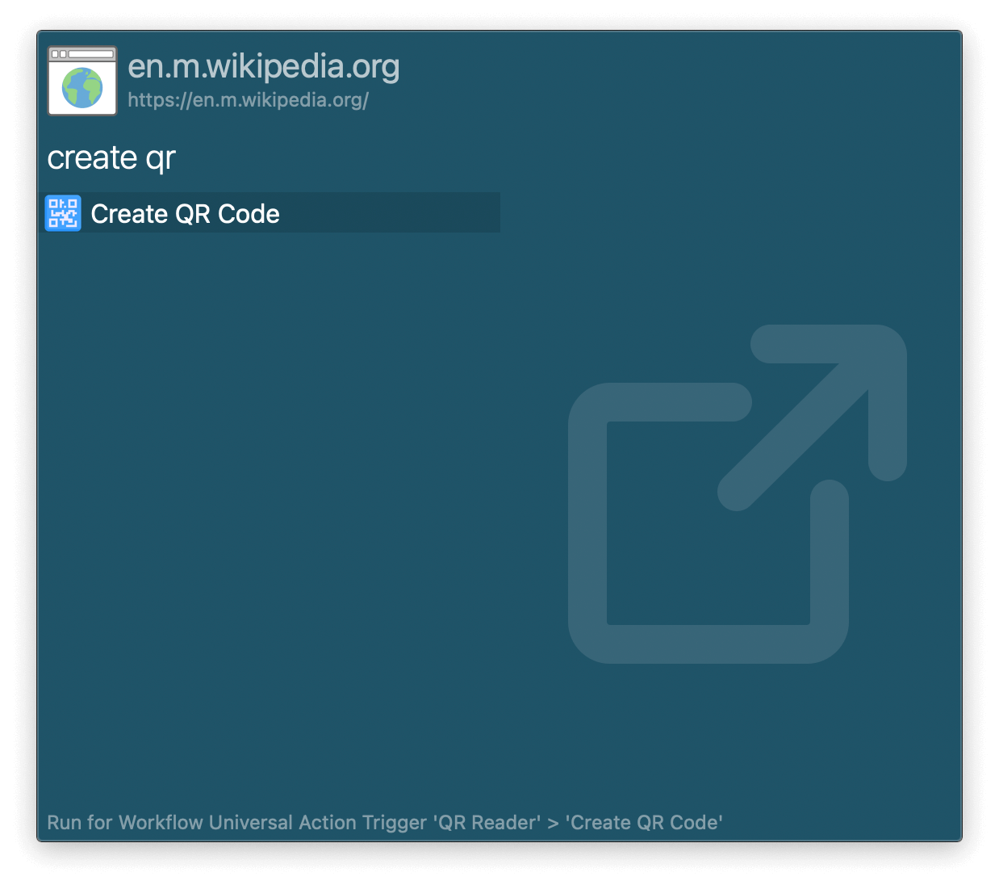

## Usage

Read the URL in a QR code image via the Universal Action.

Alternatively, capture an image in the screen via the `qr` keyword.

The resulting text will be shown in Alfred. For a URL, open it with <kbd>↩</kbd> or Quick Look it with <kbd>⌘</kbd><kbd>Y</kbd> (or tap <kbd>⇧</kbd>). If text, <kbd>⌘</kbd><kbd>L</kbd> shows the full contents in Large Type.

Generate a QR Code image from a URL with the alternative Universal Action.

