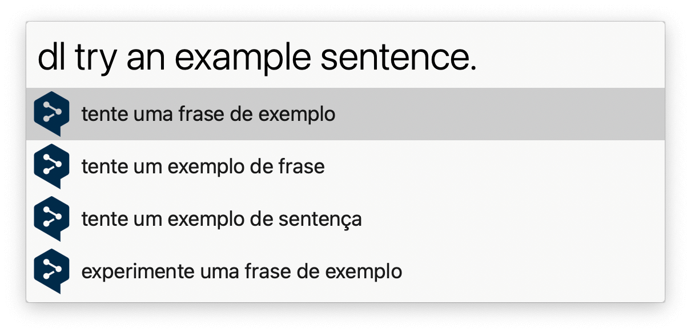
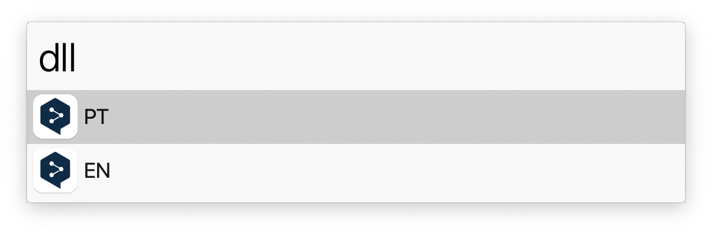

## Setup

Set your preferred target language (what text is translated to) in the Workflow’s Configuration. Optionally set an [API key](https://www.deepl.com/pro-api/) for higher limits.

## Usage

Translate sentences to another language with [DeepL](https://www.deepl.com/) via the `dl` keyword. End your queries with a `.` if you haven’t set up an API key.

* <kbd>↩</kbd> Copy to the clipboard.
* <kbd>⌘</kbd><kbd>↩</kbd> Show as Large Type.

Keywords to always translate to English (`dl-to-en`) and German (`dl-to-de`) are set up by default.

Change the target language on demand via the `dll` keyword.

