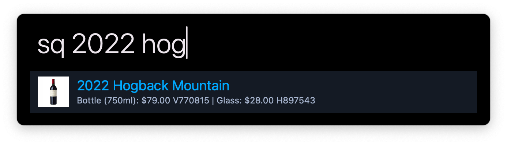
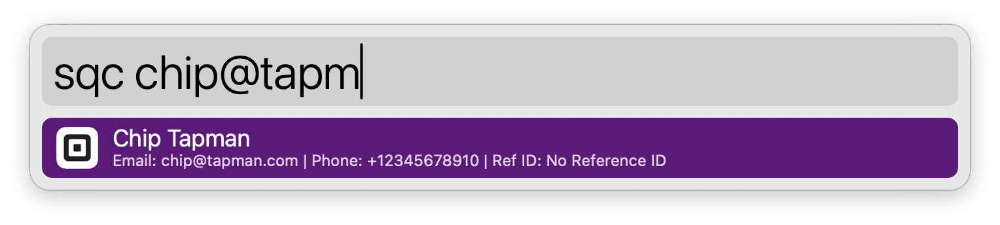

# Square Search

Search Square items, customers, and dashboard pages directly from Alfred.

This workflow lets you quickly jump to Square products, customer records, and commonly used Square Dashboard pages by typing simple keywords into Alfred.

---

## Features

- Search Square items, including variations, prices, and SKU numbers
- Search customers by email address, phone number, or reference number
- Quickly open Square Dashboard pages
- Displays product images inside Alfred

---

## Item Search

- Type the item search keyword followed by an item name
- Results show:
  - Item name
  - Variation names and prices
  - SKU number
- Press **Return** to open the item in the Square Dashboard

### Product Images

After opening an item, the workflow downloads a small copy of the product image for use in Alfred.

To download or refresh all product images manually, run: `initsquareimages`. This can take a moment, depending on how many products there are.

---

## Customer Search

- Type the customer search keyword followed by:
  - Email address  
  - Phone number  
  - Reference number
- Matching customers are displayed with relevant details
- Press **Return** to open the customer record in the Square Customer Directory

---

## Dashboard Search

- Type the dashboard search keyword followed by the page name
- Press **Return** to open the corresponding Square Dashboard page

---

## Configuration

### Square Access Token

This workflow requires a Square **Personal Access Token**.

To create one:

1. Go to the Square Developer Console:  
   https://developer.squareup.com/
2. Click **Create an Application**
3. Open the application you created
4. Go to **Credentials**
5. Copy the **Personal Access Token** under **Production**
6. Paste the token into the workflow configuration in Alfred

⚠️ **Keep your access token secure. Do not share it or commit it to public repositories.**

---

## Disclaimer

This workflow is independently developed and is not created, endorsed, or maintained by Square.  
Square and its logos are trademarks of Block, Inc. and are used solely for identification purposes.