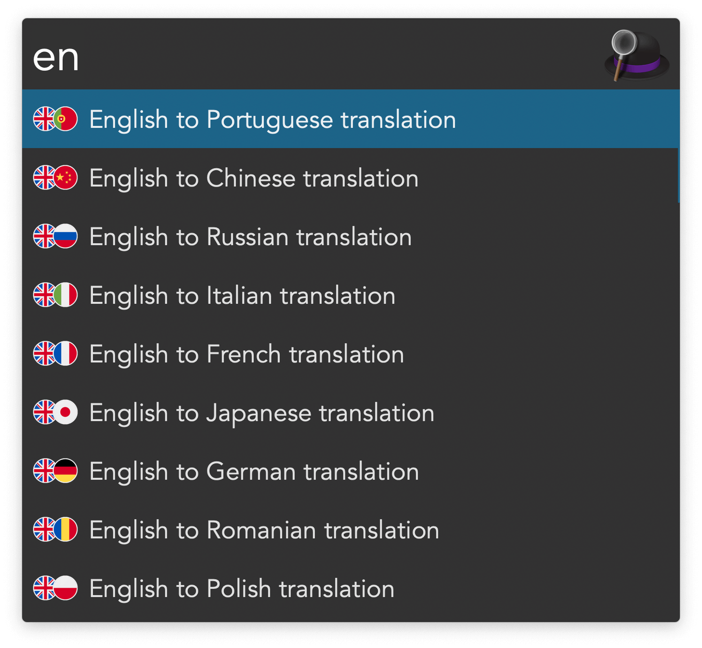
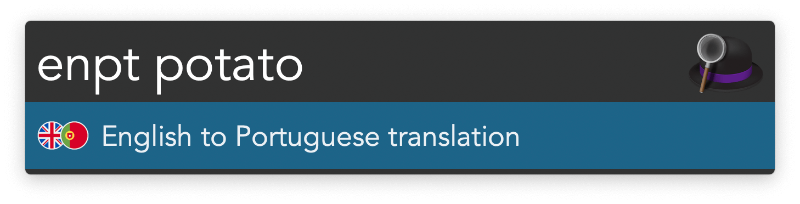
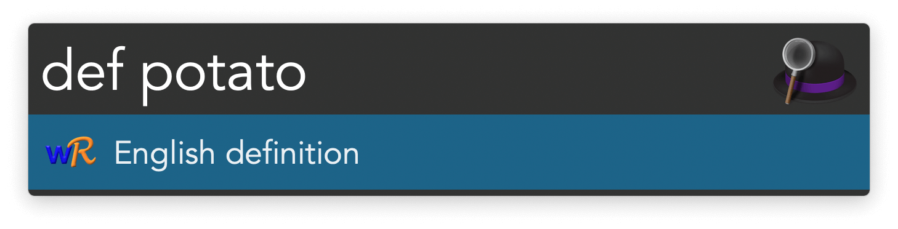

## Usage

Open [WordReference](https://wordreference.com) translation pages via the workflow’s keywords, which consist of pairs of languages. Example: `enpt` translates from English to Portuguese. Type `en` to see the languages available to translate from English. Press <kbd>↩</kbd> to autocomplete the keyword.

English isn’t the only source language supported:

* `ar` Arabic
* `zh` Chinese
* `cz` Czech
* `nl` Dutch
* `en` English
* `fr` French
* `gr` Greek
* `it` Italian
* `ja` Japanese
* `ko` Korean
* `pl` Polish
* `pt` Portuguese
* `ro` Romanian
* `ru` Russian
* `es` Spanish
* `sv` Swedish
* `tr` Turkish

Keywords are available for more than translation:

* `def` Define.
* `syn` Find synonyms.
* `use` Find usage examples.
* `col` List composites.
* `conj` Conjugate verb.

