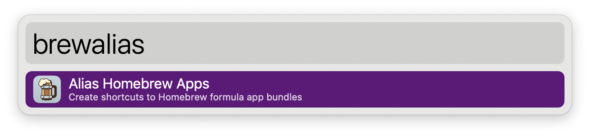
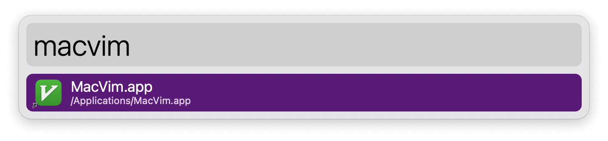

## Setup

Set the formulae you want linked in the Workflow’s Configuration.

## Usage

Alias your Homebrew Cellar apps to the Applications Folder via the `brewalias` keyword. This will allow them to be indexed by macOS and found.





To trigger the workflow from a terminal, define a `brewalias` command in your shell’s startup files:

```
alias brewalias='/usr/bin/osascript -e "tell application id \"com.runningwithcrayons.Alfred\" to run trigger \"build\" in workflow \"com.alfredapp.vitor.aliashomebrewapps\""'
```
