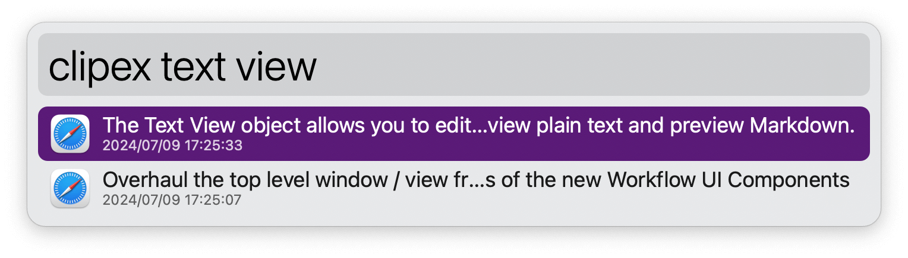
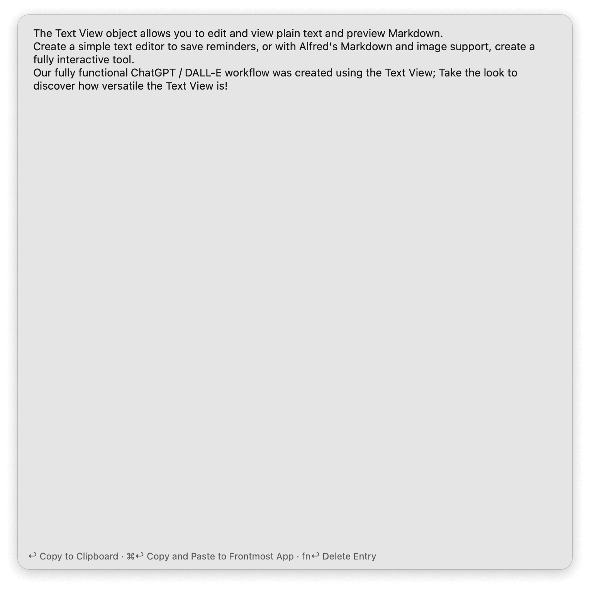

## Setup

Create an ever-expanding copy of your Clipboard History via the `clipex` keyword. A macOS launchd agent will be loaded to update it daily.

## Usage

Search for archived Clipboard History text entries via the `clipex` keyword. Press <kbd>↩</kbd> to view the full text of an entry in a Text View.

* <kbd>↩</kbd> Copy to clipboard.
* <kbd>⌘</kbd><kbd>↩</kbd> Copy and paste to frontmost app.
* <kbd>fn</kbd><kbd>↩</kbd> Delete entry from the archive.
* <kbd>⌘</kbd><kbd>⌥</kbd><kbd>⌃</kbd><kbd>↩</kbd> Force archive update.
