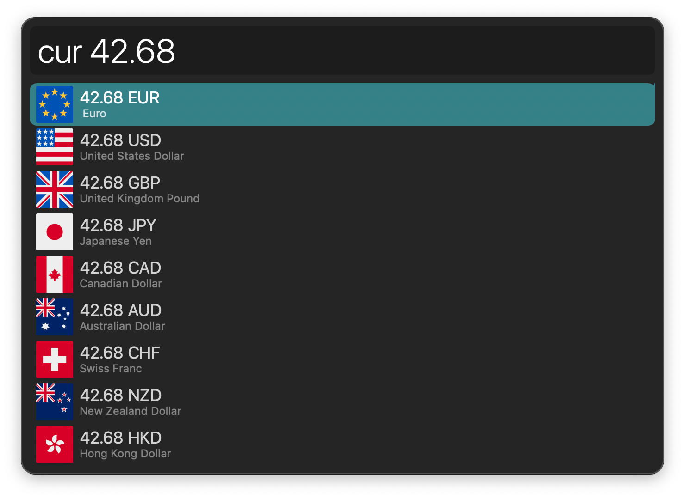
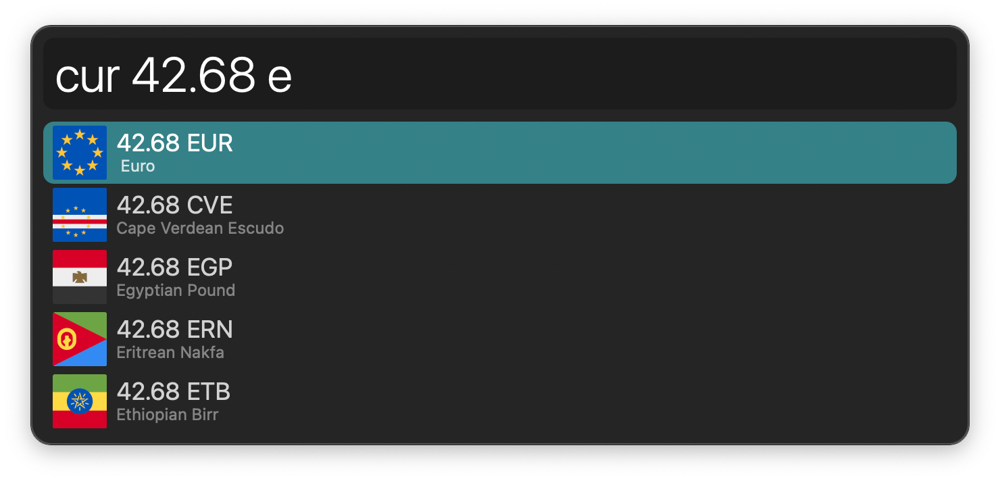
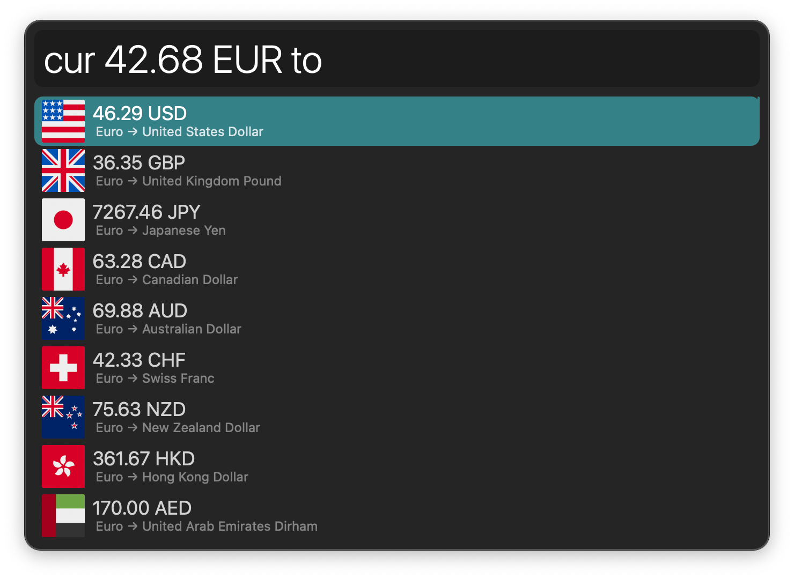
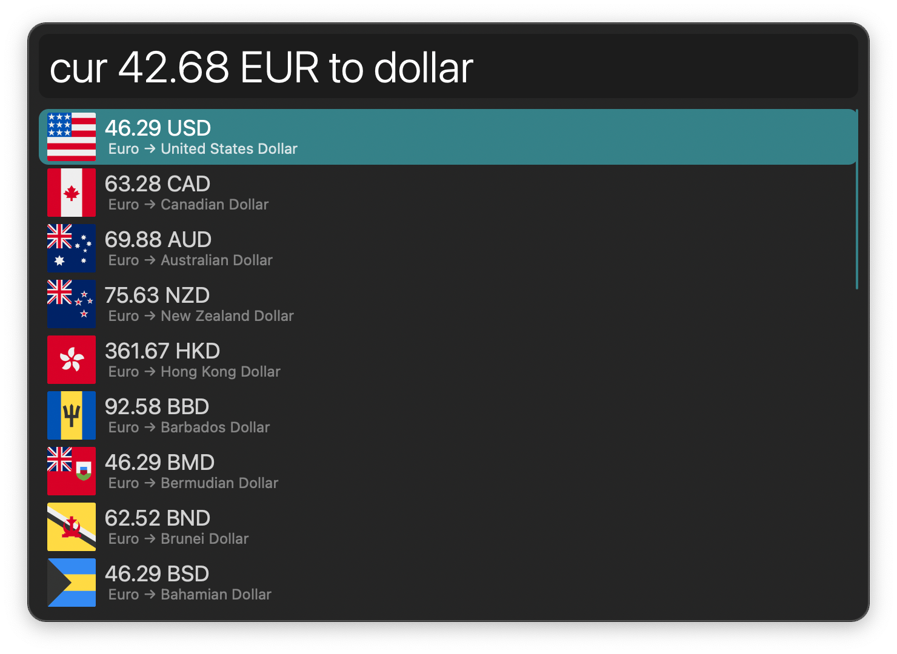
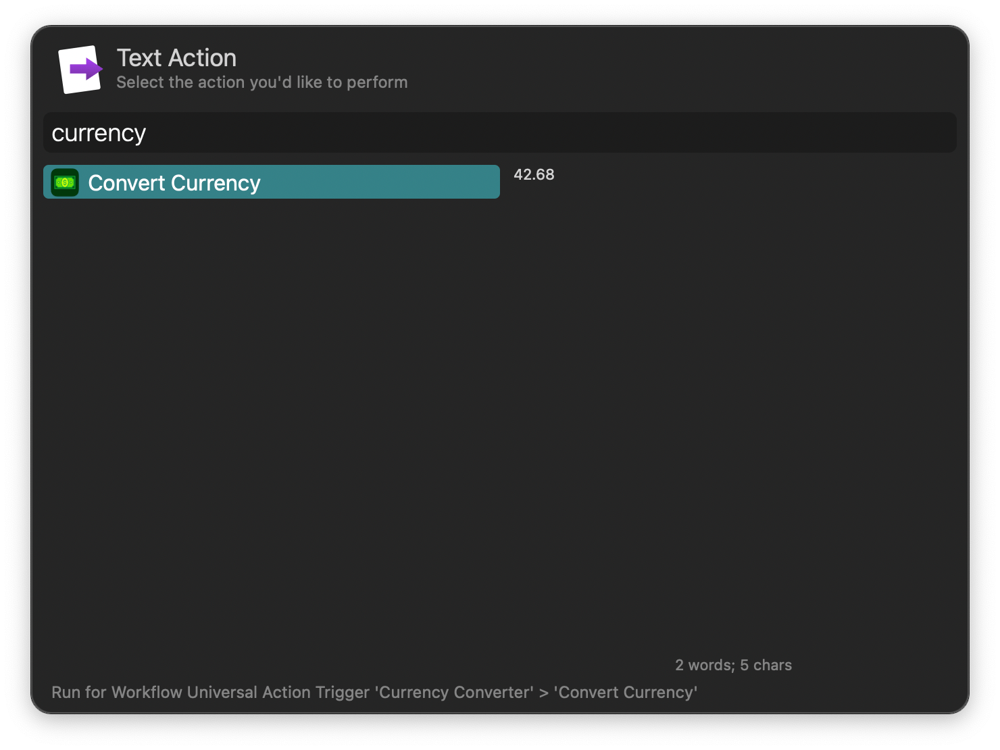

## Usage

Convert currencies via the `cur` keyword. Type a number to see all available currencies with their full name and code.

Type a currency code or name to filter.

Pressing <kbd>↩</kbd> on a partial match triggers the autocomplete. See all conversion targets when matching a unit exactly.

Type further to filter for target units. Connector words (“to”, “as”, “in”) are optional to help with readability.

* <kbd>↩</kbd> Copy result to clipboard.
* <kbd>⌘</kbd><kbd>↩</kbd> Paste result to frontmost app.

Configure the Hotkey or use the Universal Action as shortcuts to convert results from Alfred’s Calculator, Clipboard History, or selected text.

Rates provided by [Exchange Rate API](https://www.exchangerate-api.com).
