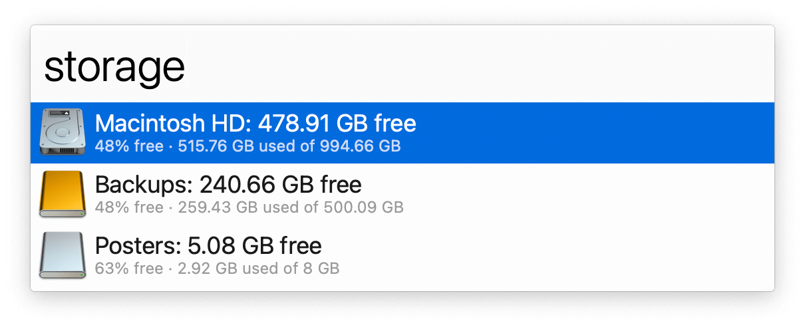

## Usage

See how much storage is being used by internal and external disks via the `storage` keyword.

* <kbd>↩</kbd> Browse volume in Alfred.
* <kbd>⌥</kbd><kbd>↩</kbd> Browse volume in the Finder.
