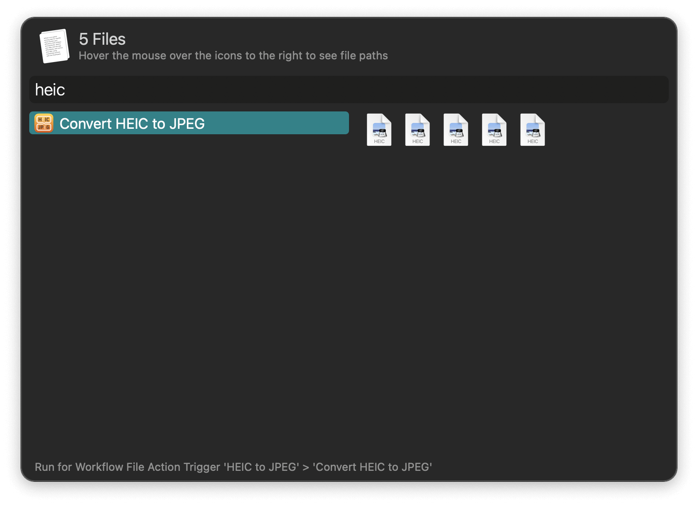
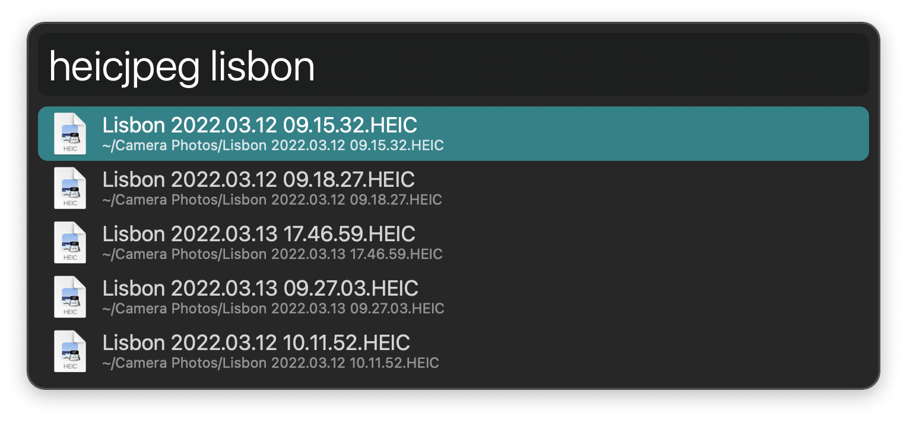

## Usage

Convert HEIC images to JPEG via the Universal Action.

Alternatively, find images with the `heicjpeg` keyword.

JPEGs are saved to the `Save Folder` set in the Workflow’s Configuration but you can immediately move them to another destination by choosing `Move to New Location` in the `After Conversion` configuration. Other options include showing a notification, revealing files in the Finder, and appending to the File Buffer.

The workflow will avoid overwriting any existing files, opting to stop rather than replace data.
