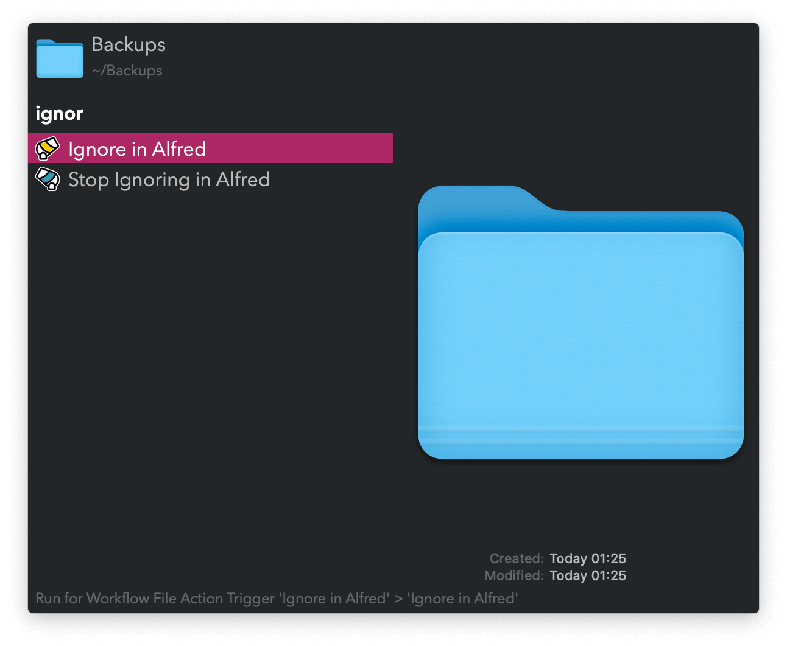

## Usage

Remove or readd files and folders from Alfred’s search results via the Universal Actions.

Alternatively, search for files and folders via the `ignore`, `unignore`, and `reignore` keywords.

