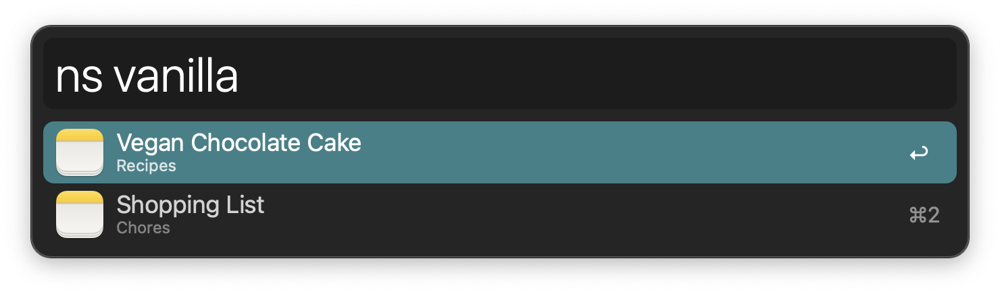
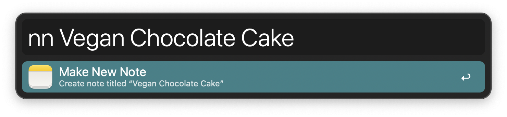
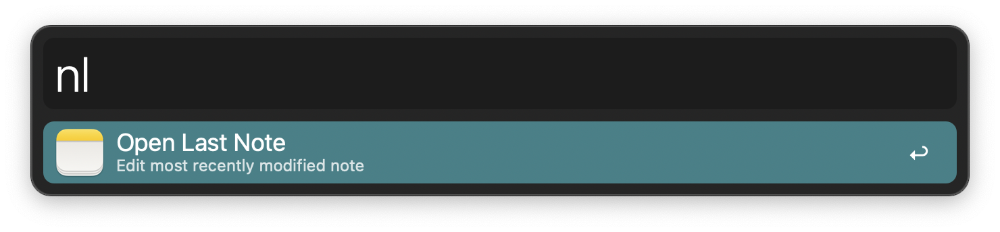

## Usage

Search notes via the `ns` keyword.

* <kbd>↩</kbd> Open note in the Notes app.
* <kbd>⌃</kbd><kbd>↩</kbd> Delete note.
* <kbd>⌘</kbd><kbd>⌥</kbd><kbd>⌃</kbd><kbd>↩</kbd> Force cache flush.

Create a new note from within Alfred via the `nn` keyword.

Quickly open the last modified note via the `nl` keyword.

Configure the Hotkeys for faster triggering.
