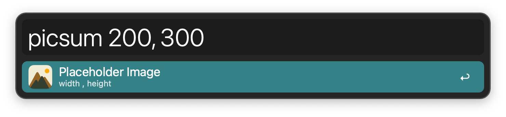

## Usage

Open the URL to a placeholder image on [Lorem Picsum](https://picsum.photos/) via the `picsum` keyword. By default the width and height are separated by a comma, but you can change it in the Workflow’s Configuration. If you only give one number, the image will be a square with that width and height.

