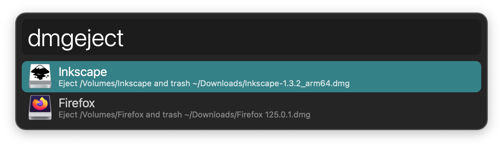
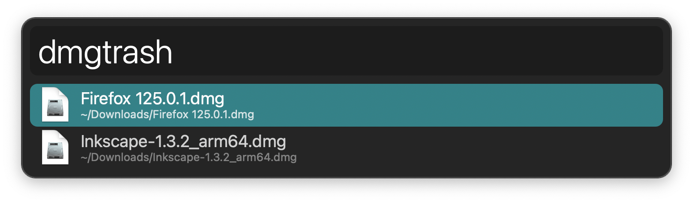

## Usage

See mounted disk images via the `dmgeject` keyword. <kbd>↩</kbd> to eject it and trash the DMG.

Find DMG files via the `dmgtrash` keyword. <kbd>↩</kbd> to trash the DMG.

In both cases, Alfred’s list refreshes if more results remain after trashing one or hides when trashing the last one.
