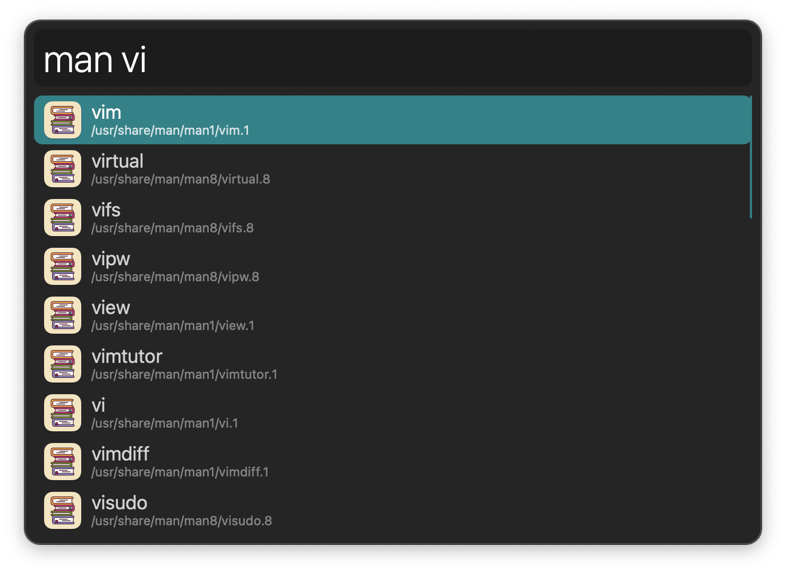
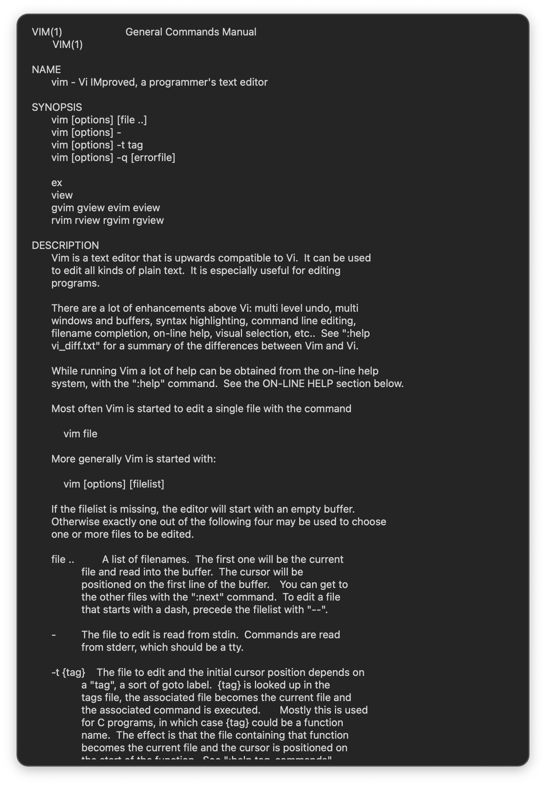
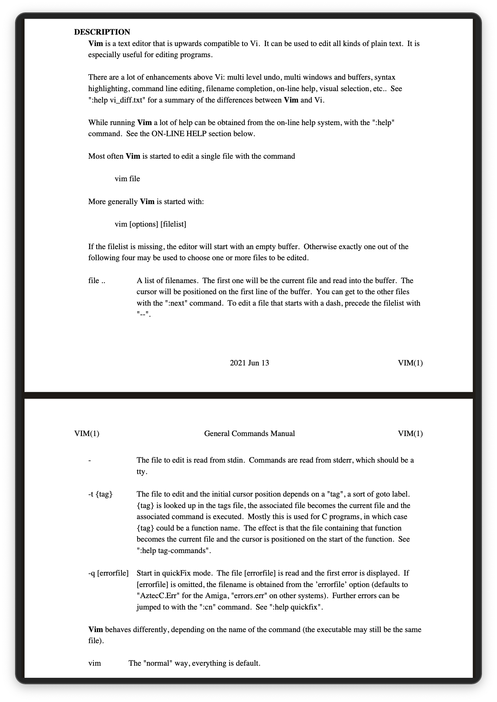

## Usage

Search installed manual pages via the `man` keyword.

* <kbd>↩</kbd> Open in primary viewer.
* <kbd>⌥</kbd><kbd>↩</kbd> Open in secondary viewer.

The viewer app set in the Workflow’s Configuration determines the generated format:

* Alfred Text View: ASCII text.
* Alfred PDF View: PDF.
* PDF App: PDF.
* Quick Look: HTML.
* Web Browser: HTML.
* Terminal: Standard view.

When viewing in Alfred, <kbd>⌥</kbd><kbd>↩</kbd> opens the alternative viewer.

