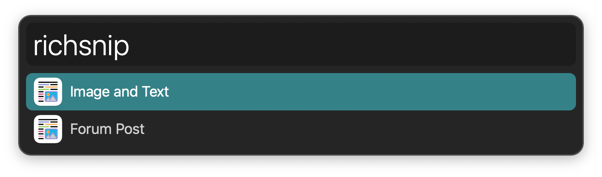
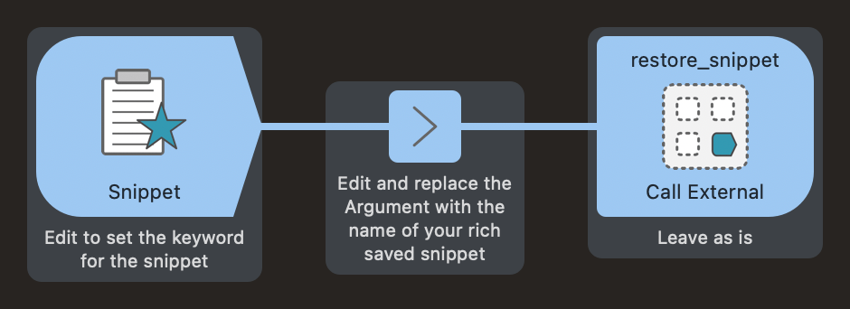

## Usage

Copy rich text, images, and other special data from the clipboard with the `richsave` keyword followed by your snippet name.

Restore a snippet to the clipboard and paste it to the frontmost app with the `richsnip` keyword. Use <kbd>⌘</kbd><kbd>↩</kbd> to delete a snippet.

Configure the Hotkeys for faster triggering.

### Triggering Like Regular Snippets

You can paste rich snippets like the others by creating a new workflow with a Snippet Trigger. Connect it to an Arg and Vars Utility with the name of the snippet as the Argument. Finally, connect it to a Call External Trigger Output referencing `restore_snippet` in this workflow.

There is an example you can copy at the bottom of the Workflow canvas.

