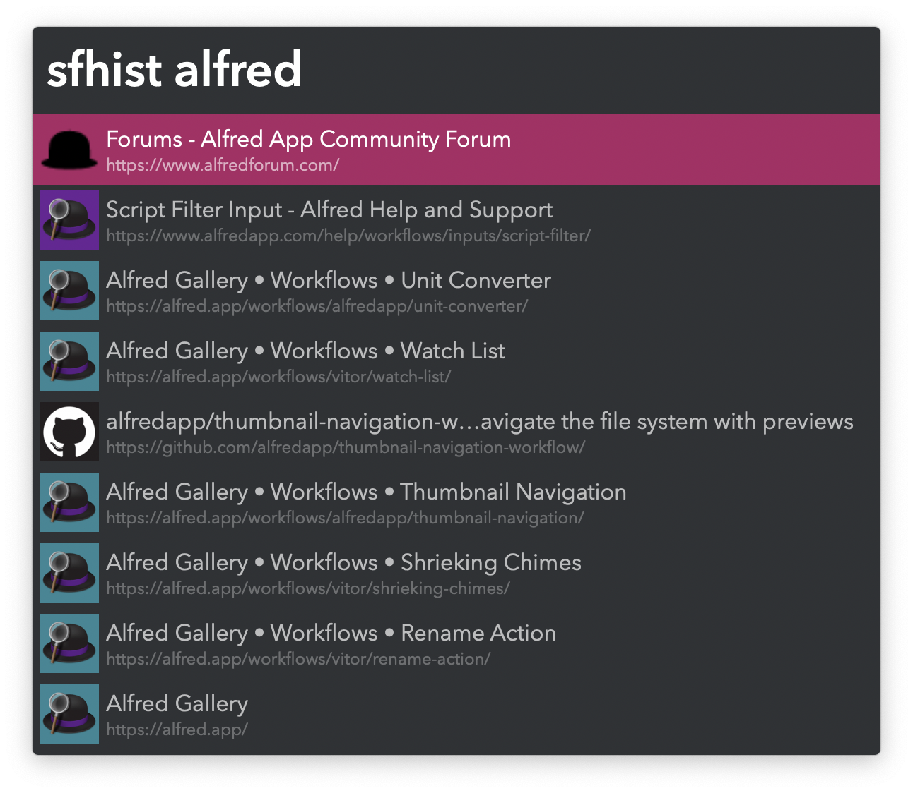
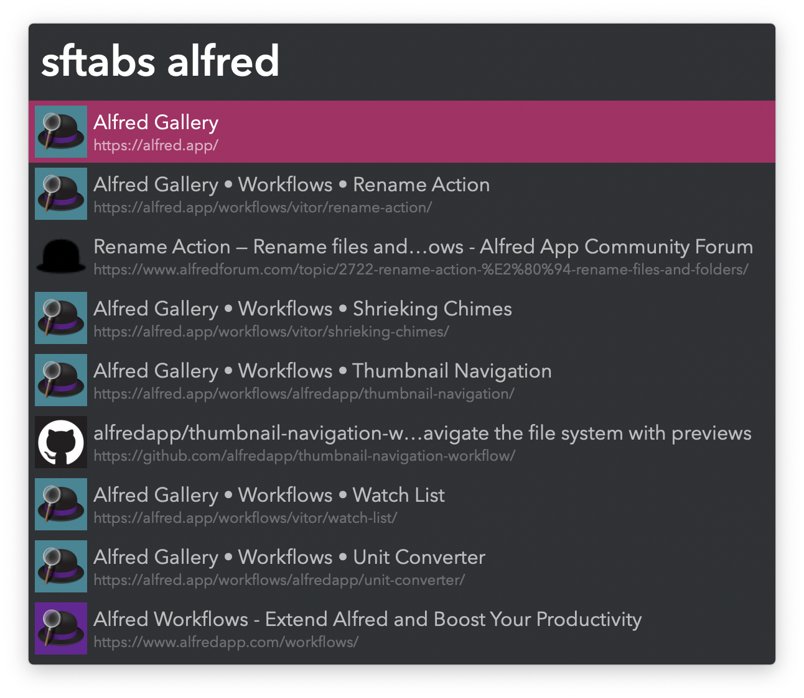
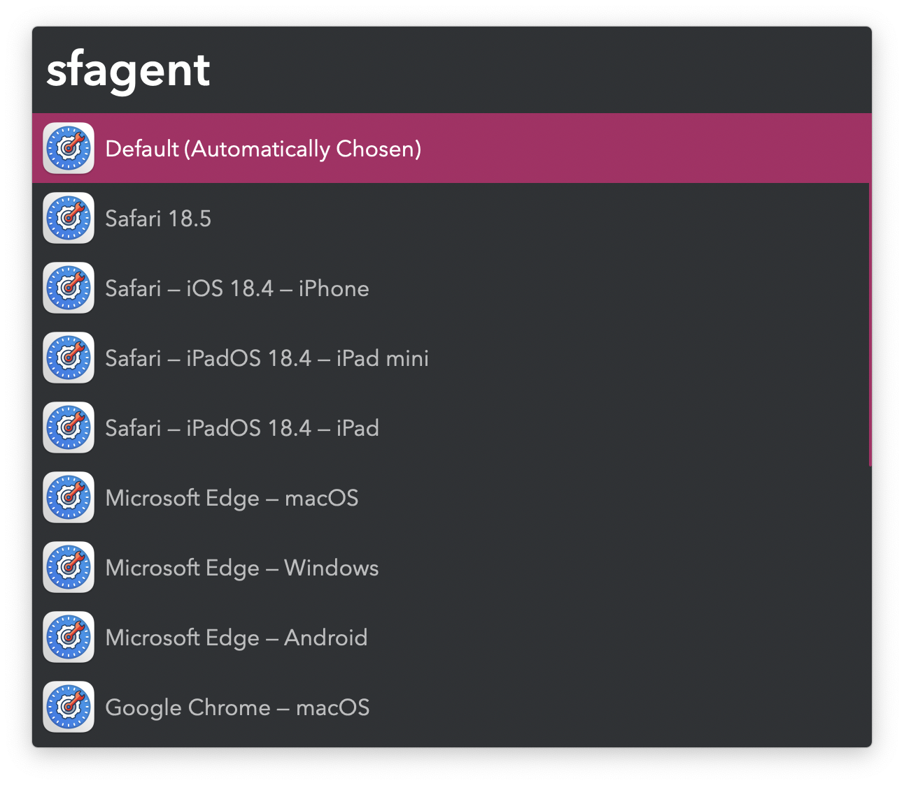

## Usage

### History Search

Search Safari history via the `sfhist` keyword.

* <kbd>↩</kbd> Open webpage.
* <kbd>⌘</kbd><kbd>↩</kbd> Open website domain.
* <kbd>⌥</kbd><kbd>↩</kbd> Edit URL before opening.
* <kbd>⌘</kbd><kbd>C</kbd> Copy URL to clipboard.

Favicons begin to populate with use.

Set the Hotkey to <kbd>⌘</kbd><kbd>Y</kbd> to override Safari’s own History.

### Tab Search

Search open tabs via the `sftabs` keyword.

* <kbd>↩</kbd> Switch to tab.
* <kbd>⌘</kbd><kbd>↩</kbd> Copy all tab URLs to clipboard.
* <kbd>⌘</kbd><kbd>⌥</kbd><kbd>↩</kbd> Copy current window tab URLs to clipboard.

### User Agent Switching

Switch User Agent for the frontmost tab via the `sfagent` keyword.

