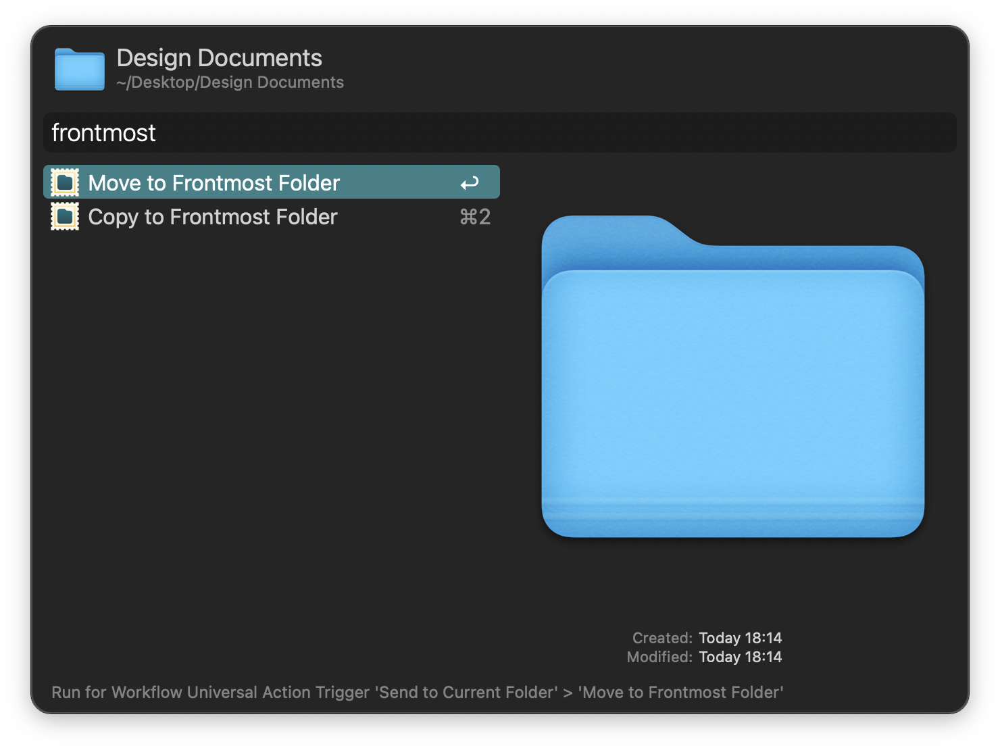

## Usage

Move or copy files to the frontmost Finder window via the Universal Actions.

* <kbd>↩</kbd> Perform the action.
* <kbd>⌘</kbd><kbd>↩</kbd> Perform the action and reopen the Universal Actions panel for the files in the new location.
