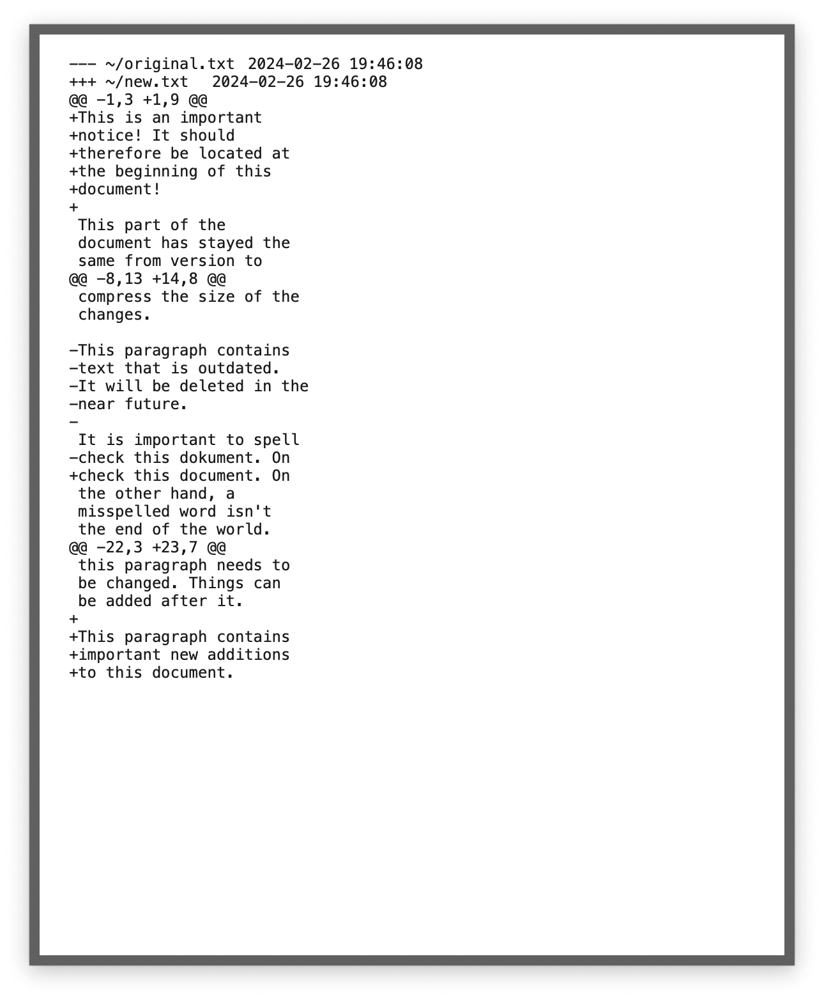
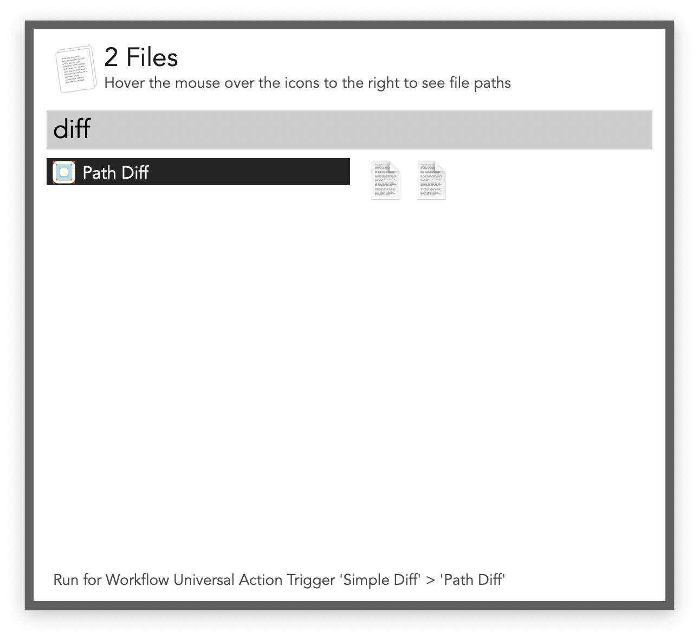

## Usage

Compare the two most recent clipboard entries via the `clipdiff` keyword. Press <kbd>↩</kbd> on the result to copy it to the clipboard.

Compare two files or folders via the Universal Action.

