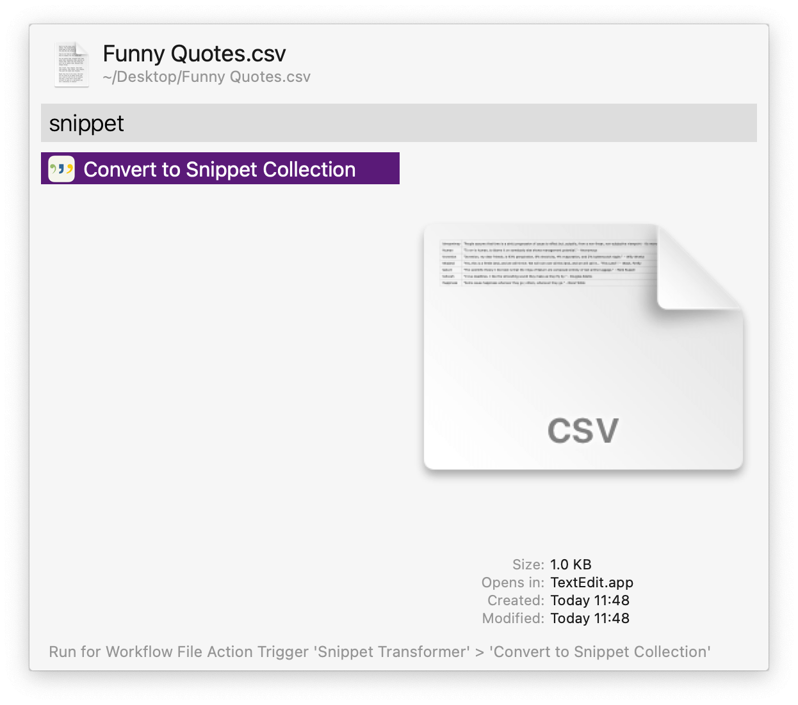
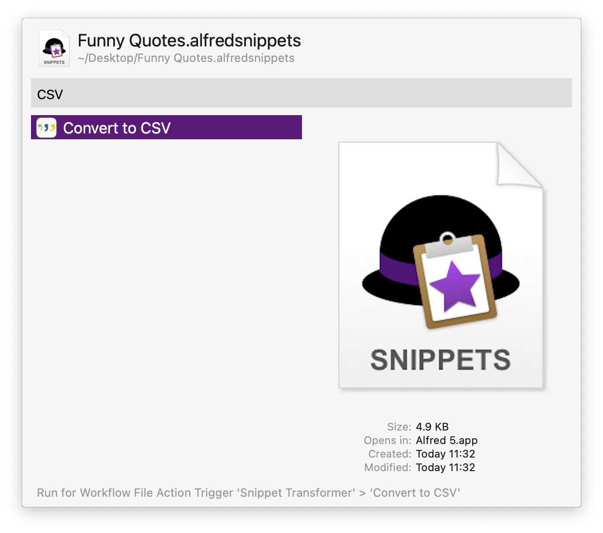
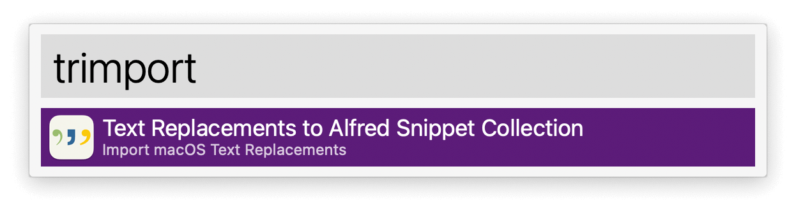

## Usage

Convert CSV files to Alfred Snippet Collections via the Universal Action. The Snippet Collection will be saved to the Desktop and opened for import into Alfred if the option is set in the Workflow’s Configuration.

Converting from a Snippet Collection to CSV is also available.

Alternatively, search for CSV or Snippet Collection files via the `csvsnip` and `snipcsv` keywords.

Import [macOS Text Replacements](https://support.apple.com/en-gb/guide/mac-help/mh35735/mac) as a new Alfred Snippet Collection via the `trimport` keyword.

