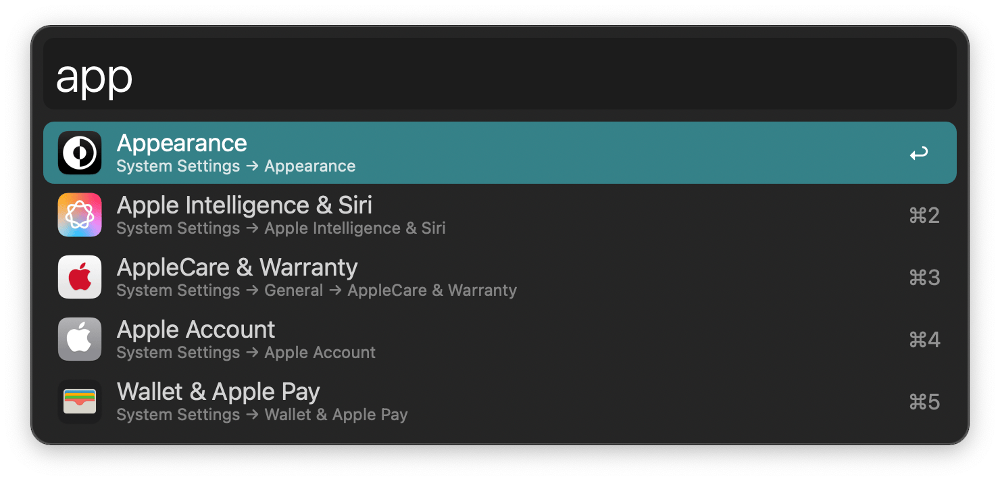
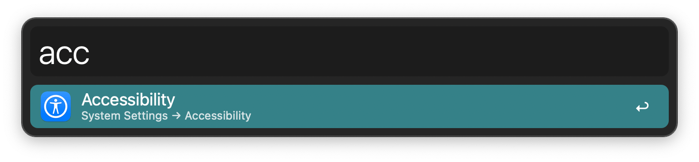
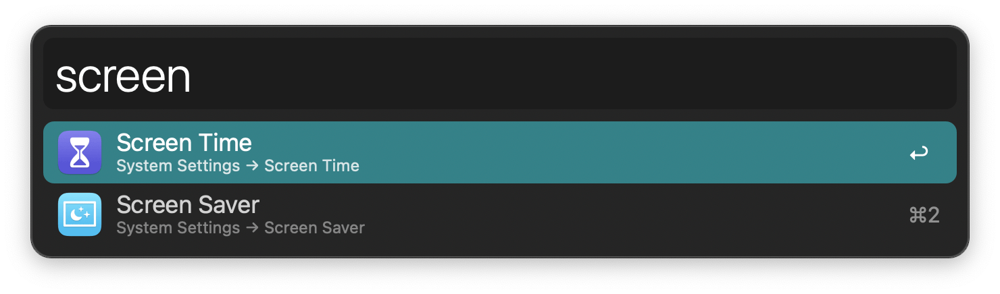

## Usage

Open System Settings panes via the workflow’s keywords: `about`, `accessibility`, `airdrop` (and `handoff`), `appearance`, `applecare` (and `warranty`), `apple account`, `apple intelligence` (and `siri`), `autofill` (and `passwords`), `battery`, `bluetooth`, `control centre`, `date` (and `time`), `desktop` (and `dock`), `device management`, `displays`, `extensions`, `family`, `focus`, `general`, `game centre`, `game controllers`, `icloud`, `internet accounts`, `keyboard`, `language` (and `region`), `lock screen`, `login items` (and `extensions`), `mouse`, `network`, `notifications`, `printers` (and `scanners`), `privacy` (and `security`), `screen saver`, `screen time`, `sharing`, `software update`, `sound`, `spotlight`, `startup disk`, `storage`, `time machine`, `touch id` (and `password`), `trackpad`, `transfer` (and `reset`), `users` (and `groups`), `vpn`, `wallet` (and `apple pay`), `wallpaper`, `wifi`.

