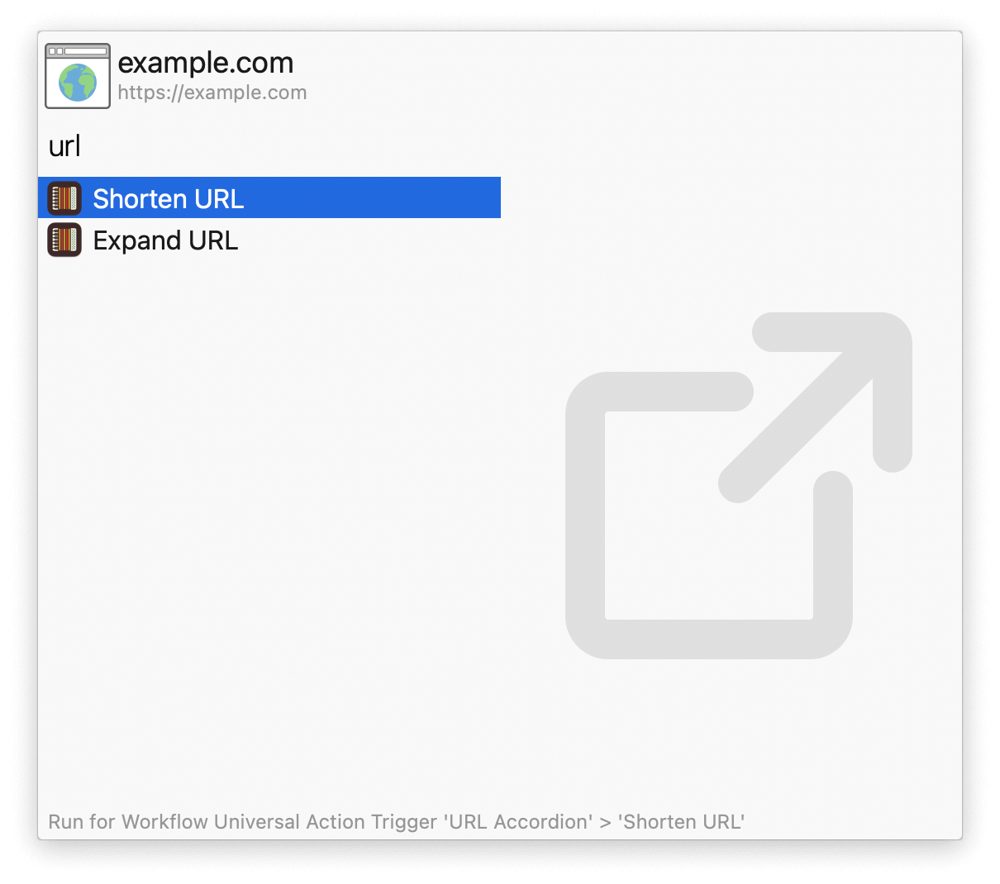

## Usage

Shorten and expand URLs via the  `shorturl` and `longurl` keywords.

* <kbd>↩</kbd> Copy result to clipboard.
* <kbd>⌘</kbd><kbd>↩</kbd> Copy result and paste to frontmost app.

Alternatively, use the Universal Actions.

