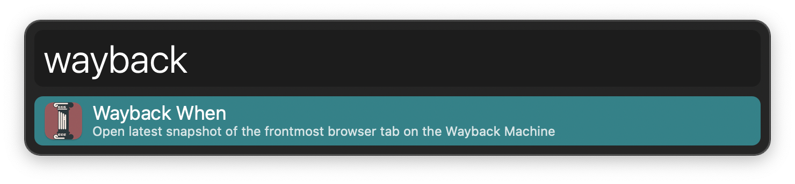
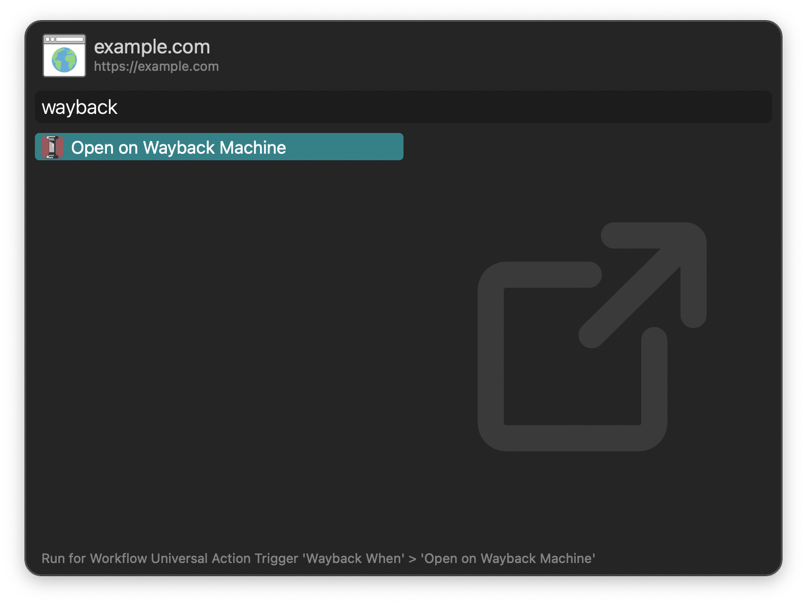

## Usage

Open the [Internet Archive’s](https://archive.org/) most recent web page snapshot for the frontmost browser tab via the `wayback` keyword.

* <kbd>↩</kbd> Open page. If no snapshot exists, fallback to the action in the Workflow’s Configuration.
* <kbd>⌘</kbd><kbd>↩</kbd> Show all snapshots.
* <kbd>⌥</kbd><kbd>↩</kbd> Force fallback.

Alternatively, perform the same actions from a selection or Clipboard History with the Universal Action.

