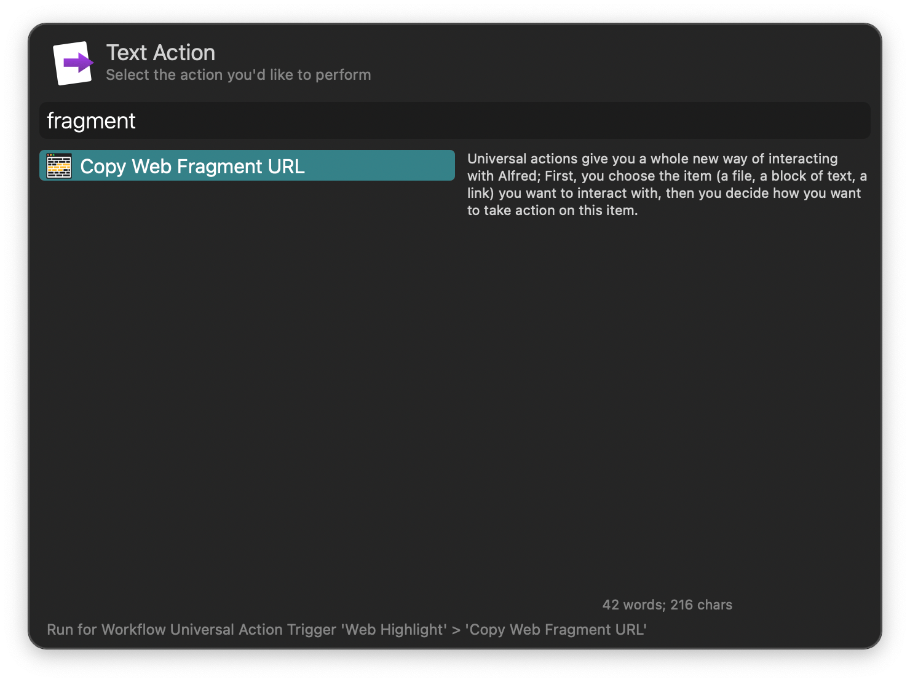
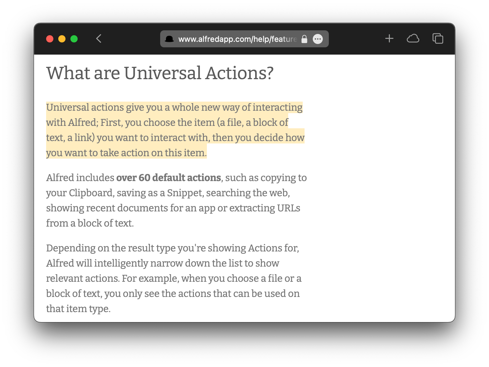

## Usage

Copy the URL to a specific text section of a webpage by triggering the Universal Action or Hotkey with text selected on a website. The resulting URL automatically scrolls to frame the text and highlights it.

Rerunning on a different selection adds the new text to the previous fragments, allowing for multiple disconnected highlights. Running the Universal Action with <kbd>⌘</kbd><kbd>↩</kbd> removes all other selections.
