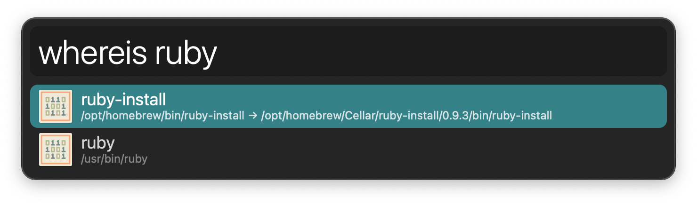

## Usage

Search for executables in [PATH](https://en.wikipedia.org/wiki/PATH_%28variable%29) via the `whereis` keyword.

* <kbd>↩</kbd> Copy original path.
* <kbd>⌥</kbd><kbd>↩</kbd> Copy resolved path if original is a [symbolic link](https://en.wikipedia.org/wiki/Symbolic_link).
