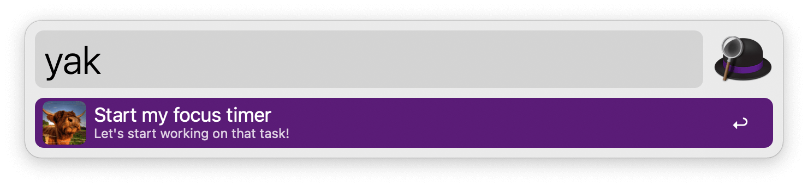

## Usage

Start a timer via the `yak` keyword. You’ll see a notification with words of encouragement pop up after 20 minutes, reminding you to stretch, breathe deeply, and get back to work. Change the time and messaging in the Workflow’s Configuration.

