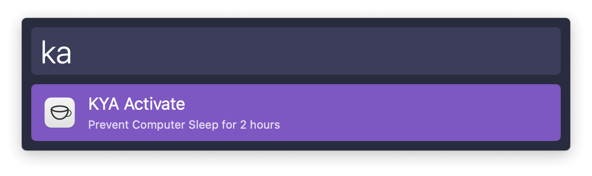
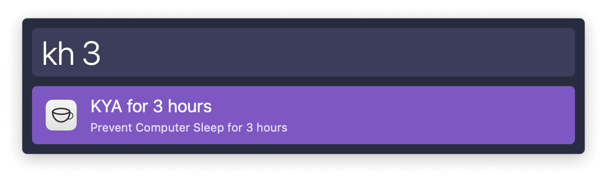
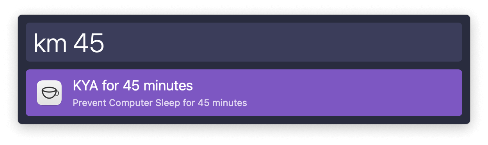
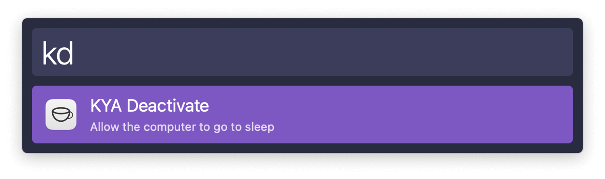

## Usage

Activate KeepingYouAwake for the number of hours set in the Workflow’s Configuration via the `ka` keyword.

Set a custom number of hours or minutes with the `kh` and `km` keywords, respectively.

Deactivate KeepingYouAwake via the `kd` keyword.

