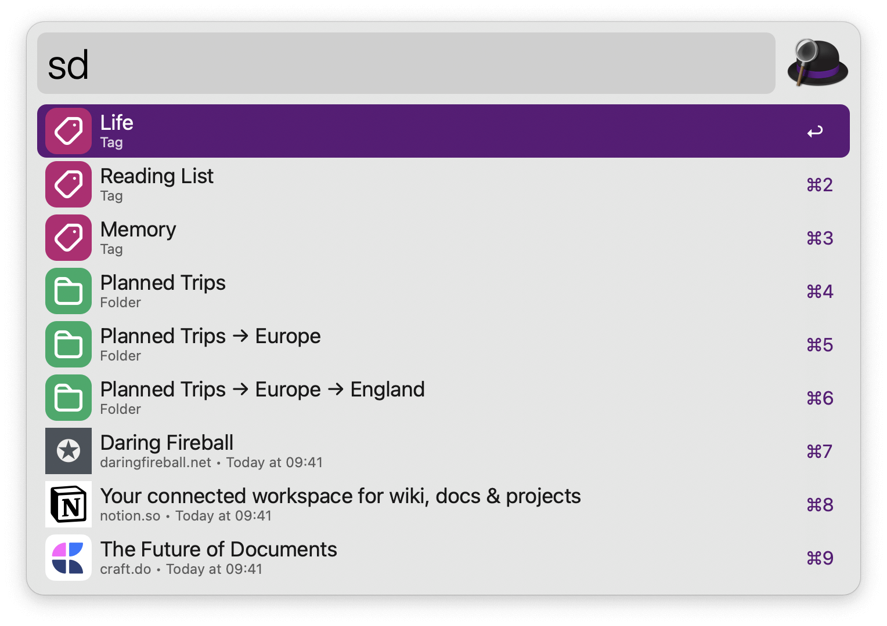

## Usage

Search links in Anybox via the `sd` keyword.

Perform other quick actions via the alternative keywords:

* `show quick save` Show Quick Save.
* `save current tab` Save Current Tab.
* `save tab tags` Save Current Tab with Tags.
* `save tab folder` Save Current Tab to Folder.
* `save clipboard` Save Clipboard.
* `save clipboard tag` Save Clipboard with Tags.
* `save clipboard folder` Save Clipboard to Folder.
* `save note` Save Note.
* `toggle anydock` Toggle Anydock.
* `toggle stash box` Toggle Stash Box.
* `toggle link detection` Toggle Link Detection.
* `switch profile` Switch Anydock Profile.
* `open all profile` Open All in Anydock Profile.
* `show list` Show List in Anybox.
