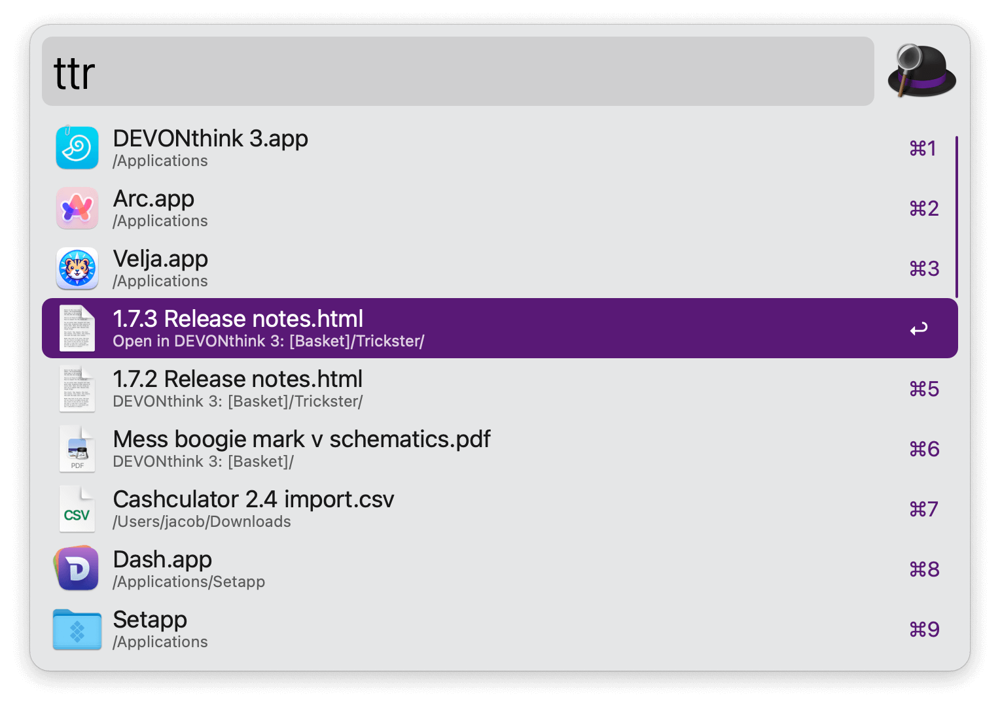

## Usage

Search through recently used files, tracked by Trickster, via the `ttr` keyword. Type more to filter. It supports entries that are sourced from other apps, like [DEVONthink](https://www.devontechnologies.com/apps/devonthink).

* <kbd>↩</kbd> Open the file in the default app.
* <kbd>⌥</kbd><kbd>↩</kbd> For DEVONthink entries, open in DEVONthink.
* <kbd>⌃</kbd><kbd>↩</kbd> Browse the file in Alfred to take further action.
