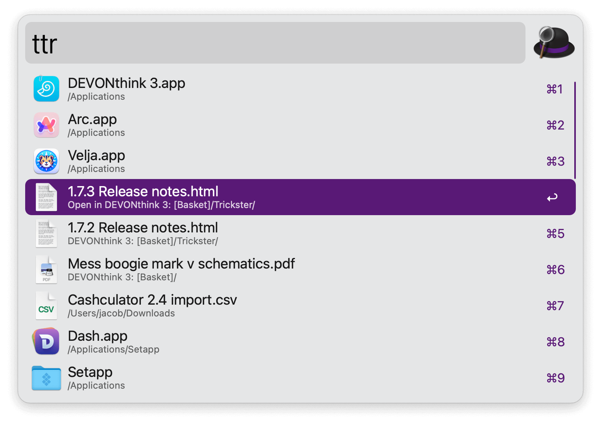

## Usage

Search through recently used files, tracked by Trickster, via the `ttr` keyword. Type more to filter. Alternatively, use the `ttf` keyword to first see the list of Trickster's filters (type to filter), and navigate into them, then type more to filter files inside Trickster's filters. It supports entries that are sourced from other apps, like [DEVONthink](https://www.devontechnologies.com/apps/devonthink).

* <kbd>↩</kbd> Open the file in the default app.
* <kbd>⌥</kbd><kbd>↩</kbd> For DEVONthink entries, open in DEVONthink.
* <kbd>⌃</kbd><kbd>↩</kbd> Browse the file in Alfred to take further action.
