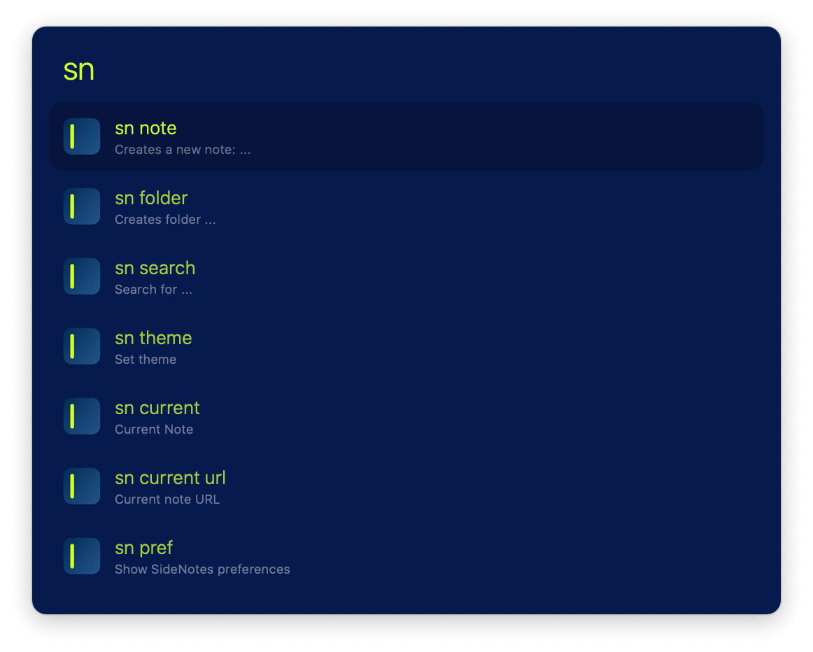
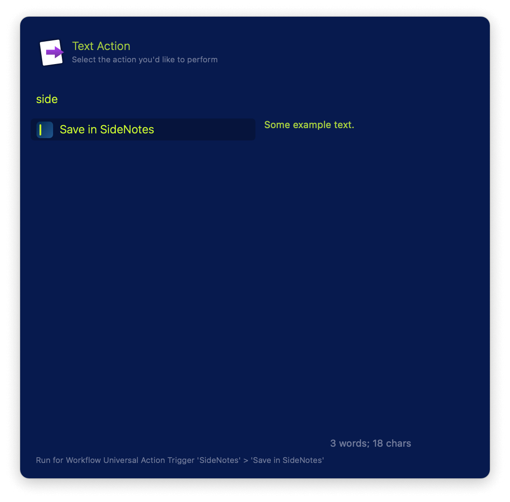

## Usage

Interact with SideNotes via the `sn` keyword:

Save text or files via the Universal Action.

See your [SideNotes snippets](https://www.apptorium.com/sidenotes/tips/how-to-use-text-snippets) via the `snippets` keyword.

* <kbd>↩</kbd> Copy snippet to clipboard.
* <kbd>⌘</kbd><kbd>↩</kbd> Paste snippet to frontmost app.

A Fallback Search is included.
