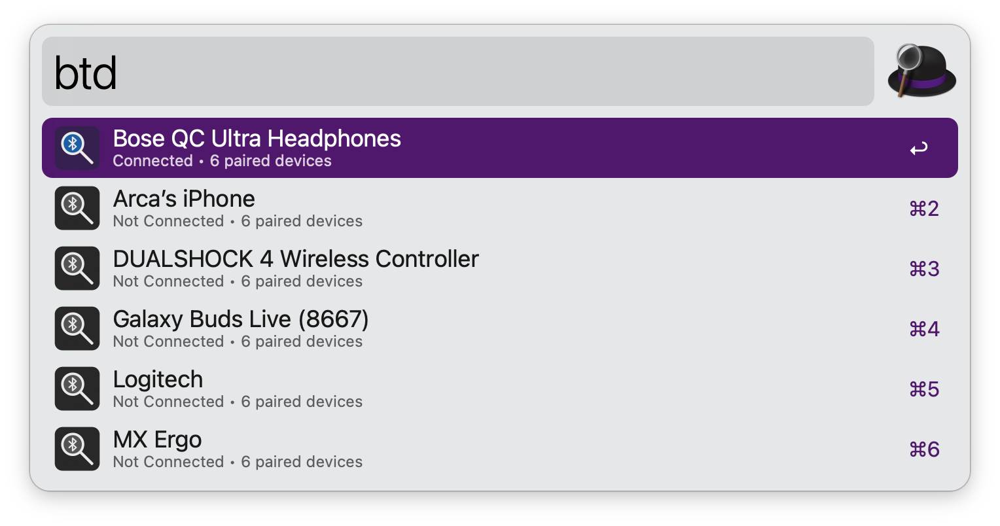
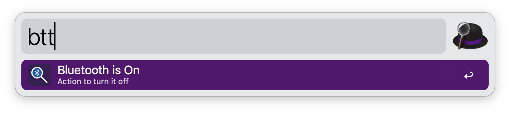

## Setup

This workflow requires [blueutil](https://github.com/toy/blueutil). Install via [Homebrew](https://brew.sh):

```
brew install blueutil
```

Grant Alfred Bluetooth permissions in System Settings › Privacy & Security › Bluetooth.

## Usage

Search paired Bluetooth devices and toggle their connection via the `btd` keyword.



* <kbd>↩︎</kbd> Toggle device connection.

The device list refreshes automatically, reflecting connection changes in real time.

Alternatively, toggle Bluetooth power system-wide via the `btt` keyword.



* <kbd>↩︎</kbd> Turn Bluetooth on or off.

Configure the trigger keywords in the Workflow's Configuration.

Inspired by Vítor Galvão's excellent [Dente Azul](https://alfred.app/workflows/vitor/dente-azul/) workflow.
