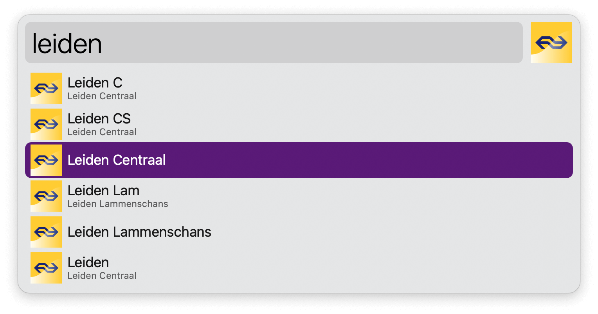
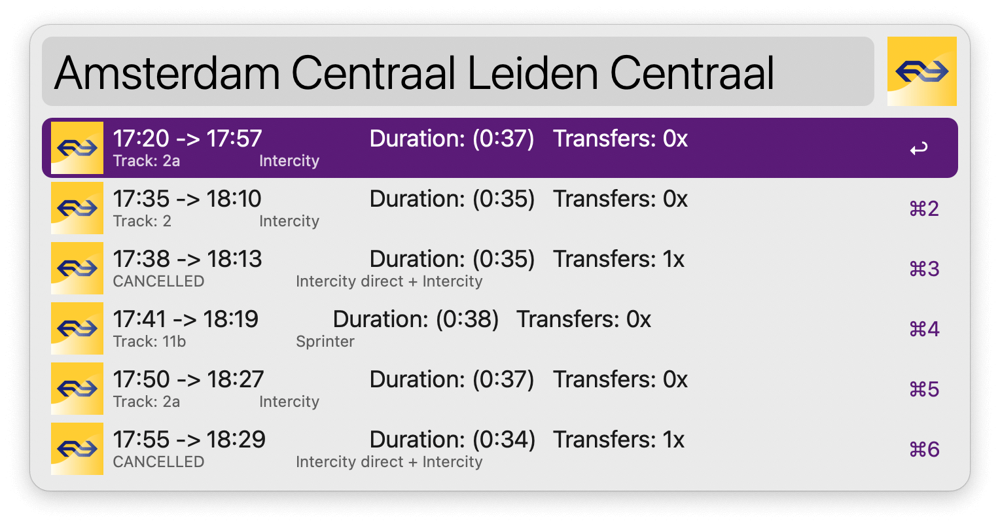

## Usage

Search the name of the origin station via the `ns` keyword. Press <kbd>↩</kbd> and pick the destination, then again to see the schedule. A final <kbd>↩</kbd> opens it on the NS website.

