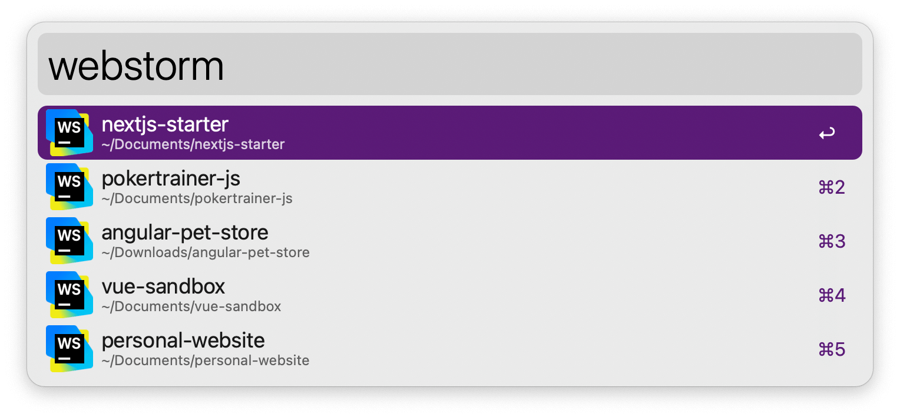
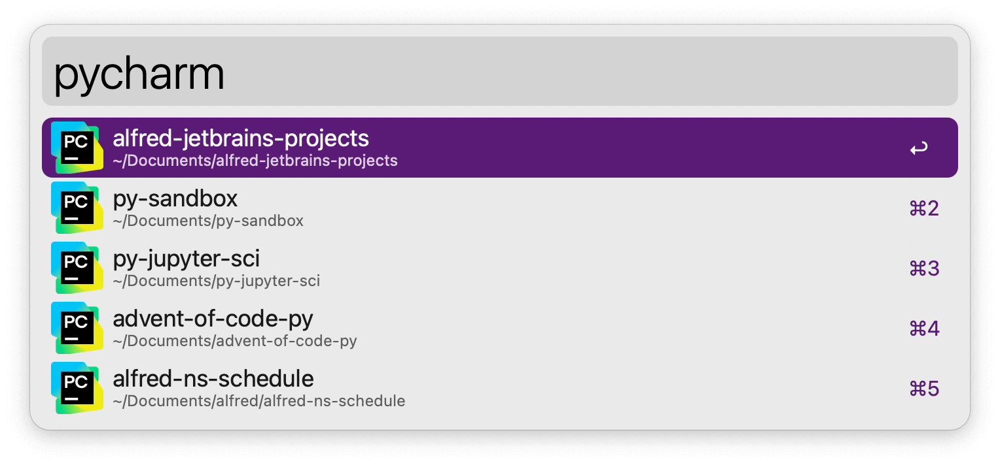

## Setup

Set the keywords for every JetBrains IDE you use in the Workflow’s Configuration. The ones you leave empty will be disabled.

## Usage

Search your recent JetBrains IDE projects via the configured keywords. Press <kbd>↩</kbd> to open the selection in the appropriate editor.

### Supported IDEs

* Android Studio 4.1+
* AppCode 2020.3+
* CLion 2020.3+
* DataGrip 2020.3+
* GoLand 2020.3+
* IntelliJ IDEA 2020.3+
* IntelliJ IDEA Community Edition 2024.3+
* PhpStorm 2024.3+
* PyCharm 2020.3+
* PyCharm Community Edition 2024.3+
* Rider 2024.3+
* RubyMine 2024.3+
* RustRover 2024.1+
* WebStorm 2020.3+
