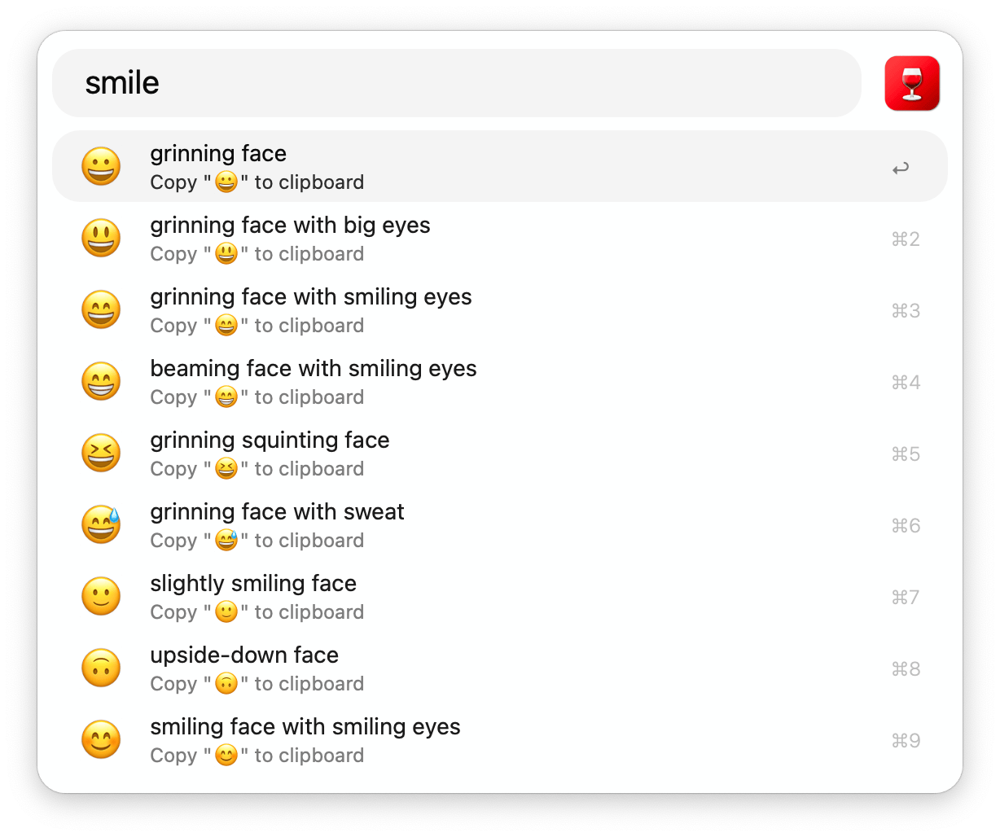
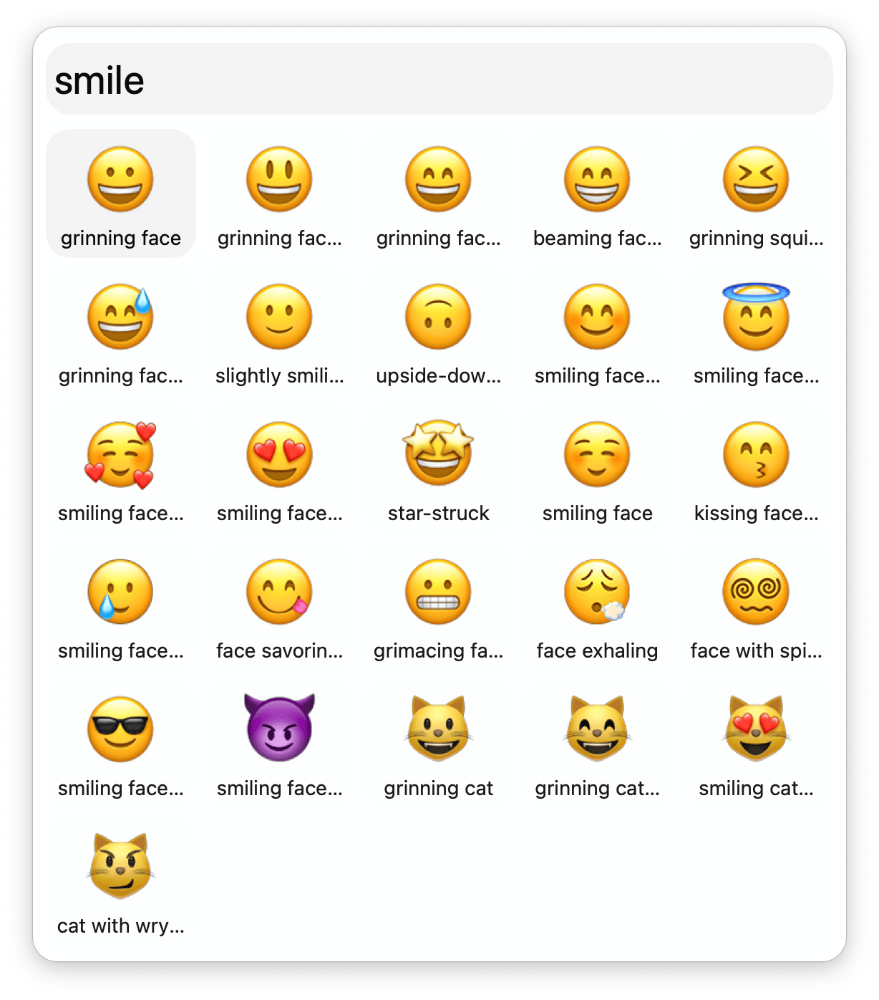
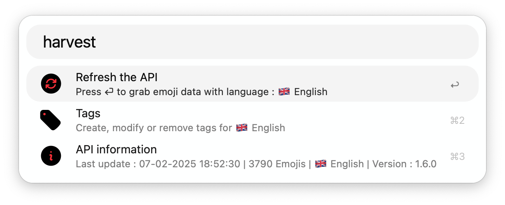

## Usage

Search emoji via the `wine` keyword.

In the Workflow’s Configuration you can switch to a grid search.

* <kbd>↩</kbd> Copy emoji to the clipboard.
* <kbd>⌘</kbd><kbd>↩</kbd> Paste emoji to frontmost application.
* <kbd>⇧</kbd><kbd>↩</kbd> Open in the online emoji dictionary defined in the Workflow’s Configuration.

Refresh the data and manage tags with the `harvest` keyword. Tags are used to search groups of emoji with custom keywords or sentences.

