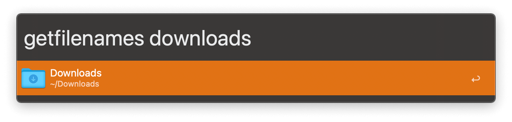
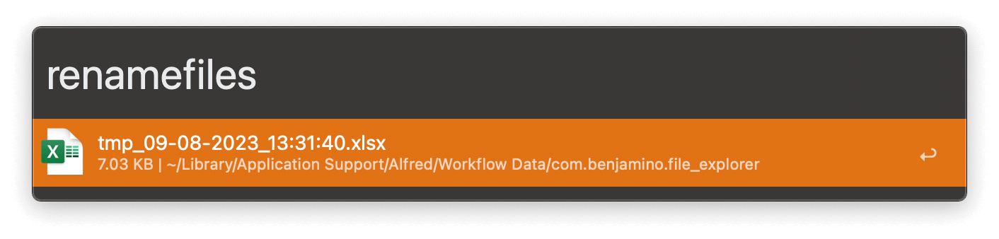
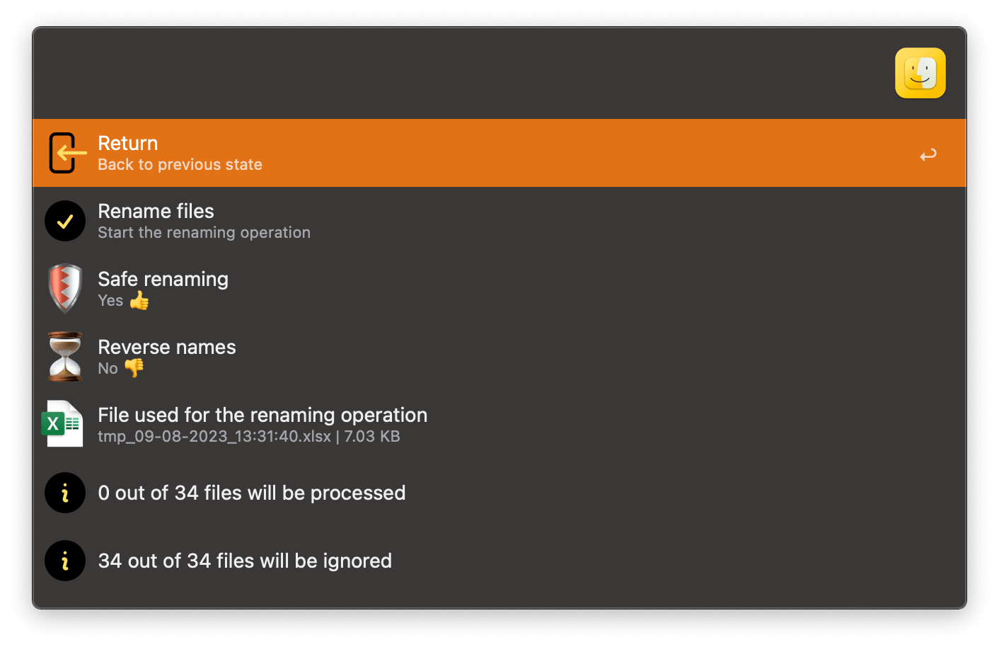

## Usage

Create an XLSX spreadsheet of files and folder contents via the Universal Action.

Alternatively, search for files and folders via the `getfilenames` keyword.

The generated spreadsheet will open in the default app, where you can edit the file names. Once finished, run `renamefiles` to choose the spreadsheet and initiate the renaming.

