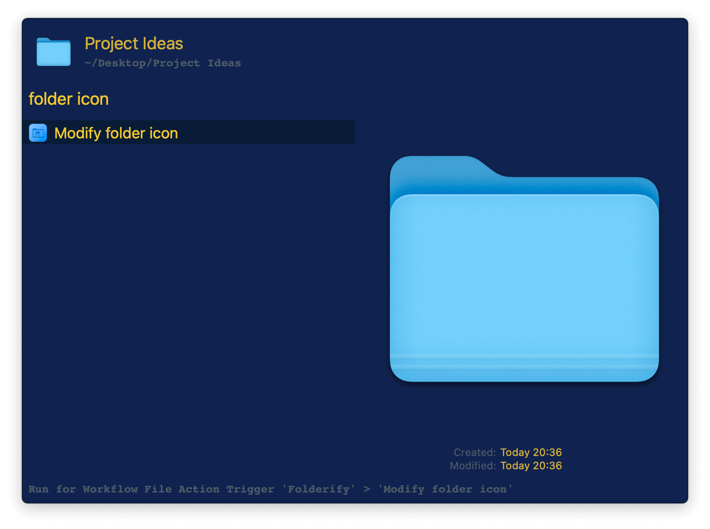
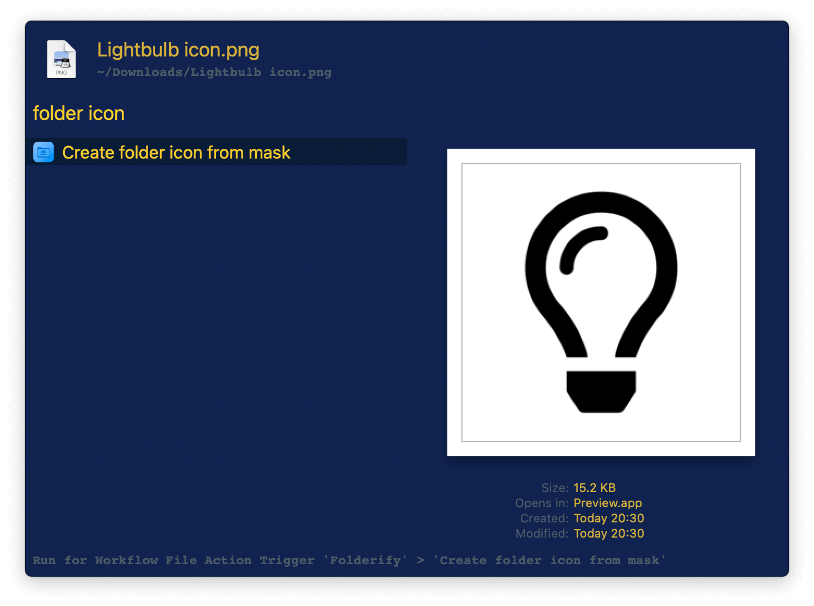

## Usage

Customise a folder icon by activating the Universal Action on a folder then searching for an image.

Alternatively, search for folders to modify via the `foldicon` keyword.

Instead of directly applying it to a folder, you can generate an icon file by activating the Universal Action on an image. The icons will be created next to it.

Alternatively, search for images to convert via the `imgicon` keyword.

