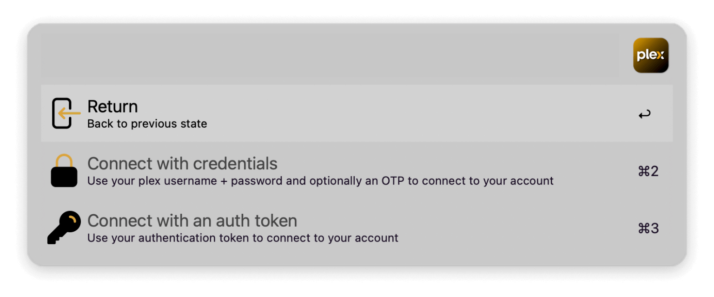
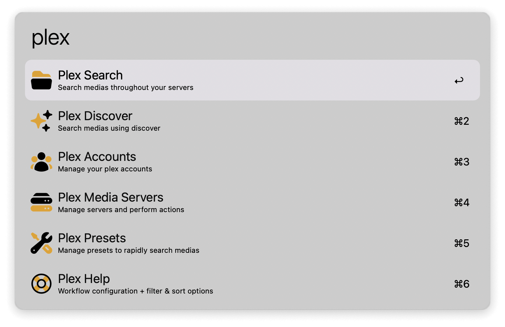
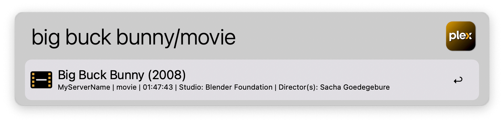
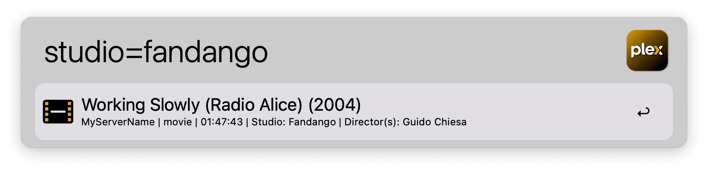
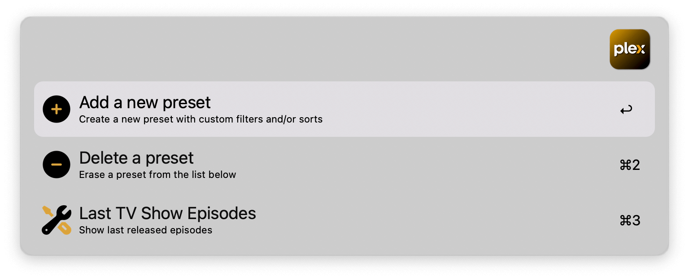
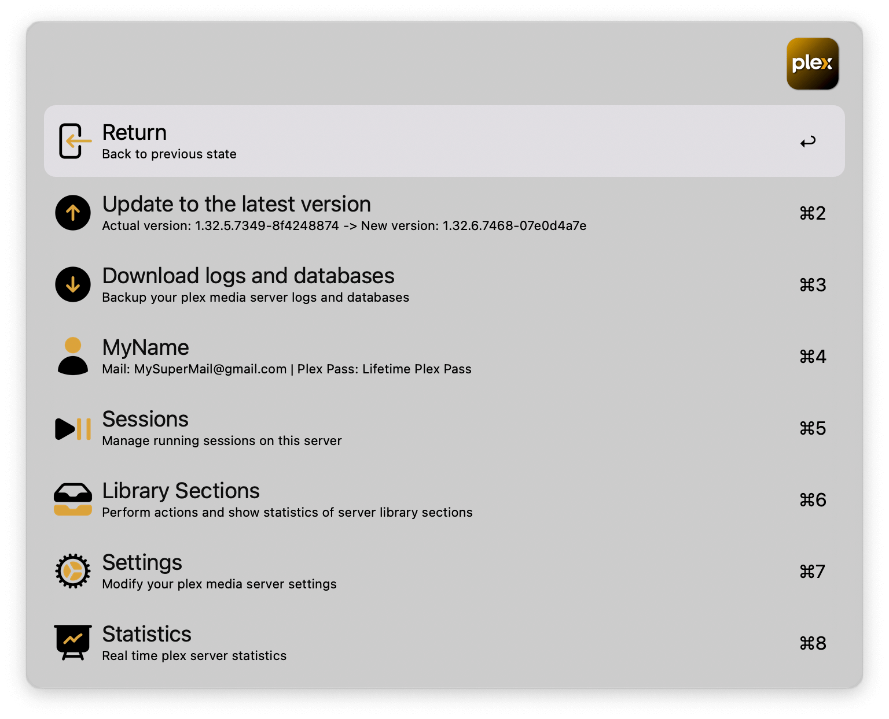
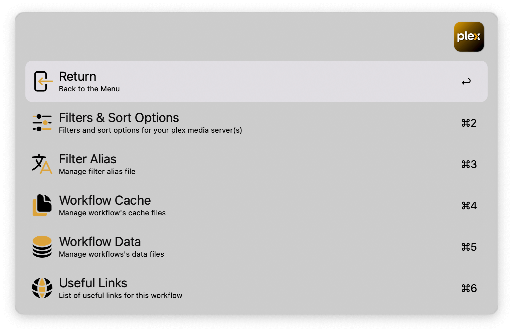

## Setup

Start the workflow with the `plex` keyword and choose `Plex Accounts` → `Connect a new plex account`. Sign in.

## Usage

Launch the workflow via the `plex` keyword.

### Plex Search

Search media within your server. Type a name and optionally its type separated by a `/`. Use the available filters and fields to search with greater precision.

* <kbd>↩</kbd> Display the child element of the media (show, season, actor, director, artist, album, genre).
* <kbd>⌘</kbd><kbd>↩</kbd> Open the media on the web (excluding genre).
* <kbd>⌥</kbd><kbd>↩</kbd> Stream the media locally (movie, episode, clip, track, album).
* <kbd>⌃</kbd><kbd>↩</kbd> Open the media using [Movie and TV Show Search](https://alfred.app/workflows/tmcknight/movie-and-tv-show-search/) (show, movie).
* <kbd>⇧</kbd><kbd>↩</kbd> Add or remove the media from the watchlist.

### Plex Presets

Manage presets for quick searches.

### Plex Media Servers

Register and manage your Plex servers.

### Plex Help

Configure the workflow and access filter and sort options.

